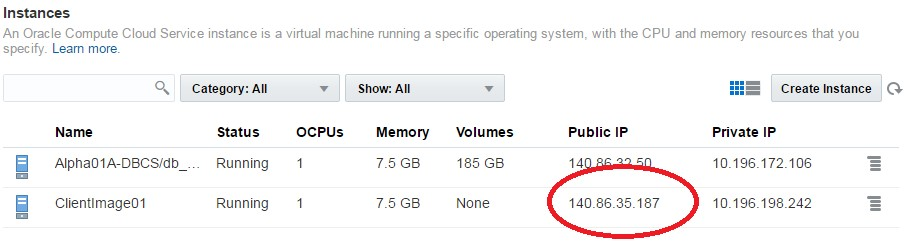

## Oracle Data Management Cloud Workshop

# Database Cloud Service


Updated: July 12, 2017


**Safe Harbor Statement**

The following is intended to outline our general product direction. It is intended for information
purposes only, and may not be incorporated into any contract. It is not a commitment to deliver any
material, code, or functionality, and should not be relied upon in making purchasing decisions.

The development, release, and timing of any features or functionality described for Oracle’s
products remains at the sole discretion of Oracle.

**Oracle Training Materials **–** Usage Agreement**

Use of this Site (“Site”) or Materials constitutes agreement with the following terms and conditions:
- 1. Oracle Corporation (“Oracle”) is pleased to allow its business partner (“Partner”) to download
and copy the information, documents, and the online training courses (collectively, “Materials")
found on this Site. The use of the Materials is restricted to the non-commercial, internal training of
the Partner’s employees only. The Materials may not be used for training, promotion, or sales to
customers or other partners or third parties.
- 2. All the Materials are trademarks of Oracle and are proprietary information of Oracle. Partner or
other third party at no time has any right to resell, redistribute or create derivative works from the
Materials.
- 3. Oracle disclaims any warranties or representations as to the accuracy or completeness of any
Materials. Materials are provided "as is" without warranty of any kind, either express or implied,
including without limitation warranties of merchantability, fitness for a particular purpose, and non-
infringement.
- 4. Under no circumstances shall Oracle or the Oracle Authorized Delivery Partner be liable for any
loss, damage, liability or expense incurred or suffered which is claimed to have resulted from use
of this Site of Materials. As a condition of use of the Materials, Partner agrees to indemnify Oracle
from and against any and all actions, claims, losses, damages, liabilities and expenses (including
reasonable attorneys' fees) arising out of Partner’s use of the Materials.
- 5. Reference materials including but not limited to those identified in the Boot Camp manifest
cannot be redistributed in any format without Oracle written consent.


## Contents

- Oracle Page
- [Section 1: Database Cloud Service Overview](##-Section-1:-Database-Cloud-Service-Overview)
   - 1.1: Introduction
   - 1.2: Objectives
   - 1.3: Lab Requirements
   - 1.4: Retrieve Public IP for Client Image
   - 1.5: Create Database Cloud Service Instance
   - 1.6: Configuration and Image Exploration
- [Section 2: Cloud Migration](#Section-2:-Cloud-Migration)
   - 2.1: Introduction
   - 2.2: Objectives
   - 2.3: System Requirements
   - 2.4: Cloud Migration Using Pluggable Databases
   - 2.5: Cloud Migration Using Data Pump
   - 2.6: Cloud Migration Using SQL Developer Carts
- [Section 3: Backup and Recovery](#Section-3:-Backup-and-Recovery)
   - 3.1: Introduction
   - 3.2: Objectives
   - 3.3: Lab Requirements
   - 3.4: Oracle Public Cloud Backup Recovery
- [Section 4: Database Development](#Section-4:-Database-Development)
   - 4.1: Introduction
   - 4.2: Objectives
   - 4.3: Lab Requirements
   - 4.4: Alpha Office and APEX


Section 1: Database Cloud Service Overview
=============================================
### 1.1: Introduction


This lab will help give you a basic understanding of the Oracle Database Cloud Service and it’s
capabilities around administration and database development.

We will walk through creating a new Database Cloud Service instance. After the database has
been created, you will connect into the Database image using an SSH private key and familiarize
yourself with the image layout. Next you will learn about SSH tunneling using an SSH
configuration file. This file will be used to tunnel multiple ports to a remote OPC instance. Using
the tunnels, you will learn how to access various Database consoles.

### 1.2: Objectives

```
 Create Database Cloud Service
```
```
 Configure security with SSH
```
```
 Explore VM and cloud consoles
```
### 1.3: Lab Requirements

```
 VNC Viewer to connect to an Image running on Oracle’s IaaS Compute Service.
```
```
 Laptop capable of connecting to the internet and running VNC Viewer
```
```
 Cloud environment access details provided by instructor in advance of the class
```
`Note: Use the table below and fill in the blanks as you go through the labs. Create a text file or
note on your VNC desktop to keep track of important information you’ll need throughout the lab
exercises so that you can easily copy and paste the information.`

Lab info                                    | Corresponding information |
--------------------------------------------|---------------------------|
|Cloud Data Center:                         |                           |
|Identity Domain:                           |                           |
|Login Username (s):                        |                           |
|Login Password:                            |                           |
|Alpha01A-DBCS Cloud Public IP Address:     |                           |
|Alpha01A-DBCS Cloud Private IP Address:    |                           |
|Site Location ID:                          |                           |
|Alpha01B-DBCS Cloud Public IP Address:     |                           |
|Alpha01B-DBCS Cloud Private IP Address:    |                           |
|Client Public IP Address:                  |                           |
|Client Private IP Address:                 |                           |
|VNC Viewer Port #:                         |                           |
|Client Image VNC Viewer Password:          |                           |

### 1.4: Retrieve Public IP for Client Image.................................

For the Database Cloud Service Workshop we will be using a Client Image running in the Oracle
Compute cloud to simulate the on premise environment. This client image is running Linux and
contains a preinstalled Oracle 12.1.0.2 database with a pluggable database that we will migrate
to the Oracle Public Cloud Database instance. The client image contains SQL Developer 4.1,
SQL*Plus and other utilities that will be used to connect and manipulate both the local and cloud
database instances.

The Client Image is a VM that is running on Oracle’s IaaS Compute service.

**1.4.1: RETRIEVE PUBLIC IP FOR CLIENT IMAGE**

```
 Login to your Oracle Cloud account
```
```
 Open a browser and go to the following URL: https://cloud.oracle.com
```
```
 Click Sign In in the upper right hand corner of the browser
```


 Under My Services > Select Data Center ... select the region from the drop down list. Your
instructor will provide this information to you prior the course.

```
 Enter the identity domain and click Go
```

```
 After entering the Identity Domain you will enter the User Name and Password
```
```
 Click Sign In
```

NOTE: The Identity Domain, User Name and Password values were provided to you by your
instructor prior to starting this lab.

```
 You should see the Dashboard summarizing all of your available services. Compute,backup, and storage are all related to the Database Cloud Service.
```


 If there’s a service that’s not visible, **click** on the **Customize Dashboard** dropdown and
add each service as a favorite by clicking on the **Show** button next to the service.

 From the main dashboard, click on the **Compute** service link to access the Compute
Service Console. This is where we will get the IP address of our database service.

 From this page you can view general information about this Compute Cloud Service.
Click on the **Open Service Console** button.

 The Compute Service Console will give you a summary of the resources your cloud
service is using and a list all running VM’s.


 Identity Domains have multiple sites. If you don’t see your VM images in the Compute
Console, you may be in the wrong site.


 Please ask your instructor which site the Client Image is running on. If necessary, click
the **Site** dropdown at the top of the page to access the **Site Selector** and choose the
correct site.


 Once the correct site has been selected, locate the instance named **ClientImage01** and
copy the **Public IP**.
```
 Note: Keep this IP Address somewhere accessible, like a notepad or text document.
We will use this IP with VNC to connect to the cloud client desktop.
```

- 1.4.2: CONNECT TO CLIENT IMAGE USING VNC VIEWER
```
 From your desktop run the VNC Viewer application and enter the Public IP address you just obtained, with a display port separated from the IP address by a colon <:443> and click Connect
```
Note 1 : If connecting inside an Oracle office _through the ‘clear_ - _guest’ network,_ and the VNC
_session won’t connect or times out, try port :10._

Note 2 : If you do not already have a VNC Viewer installed on your computer you will need to
download it. Or ask the instructor for the Real VNC Viewer executable.


 Click Continue on the encryption message.


 Enter the password supplied by your instructor and click **OK**


 Verify that you can see and interact with the Linux desktop. You are now connected to
the Client Image that will be used for all labs.


### 1.5: Create Database Cloud Service Instance

```
1.5.1: LOGIN TO YOUR ORACLE CLOUD ACCOUNT
```
 From within the VNC Session open the **Google Chrome browser** and go to the
following URL: <https://cloud.oracle.com>
```
 Click Sign In in the upper right hand corner of the browser
```
```
 Under the Cloud Account field click on the Select Data Center drop down, choose the data center location (for demos and trials, it’s usually EMEA) then click on the My Services > button.
```
**IMPORTANT** - Under My Services, the **Data Center location** is provided to you in the _***lab connection instructions***_.


 In the next screen enter the **identity domain** and click **GO**


 Enter the cloud User Name and Password and click **Sign In**


**NOTE**: The **Identity Domain**, **User Name** and **Password** values are provided in the __lab
connection instructions__.

```
 You should see the Dashboard summarizing all of the available services.
```


- 1.5.2: CREATE DATABASE CLOUD SERVICE

 From the main dashboard, click on the __***Database***__ service link


