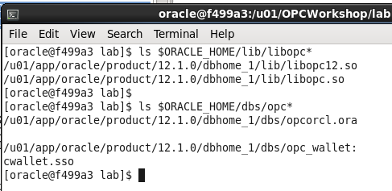
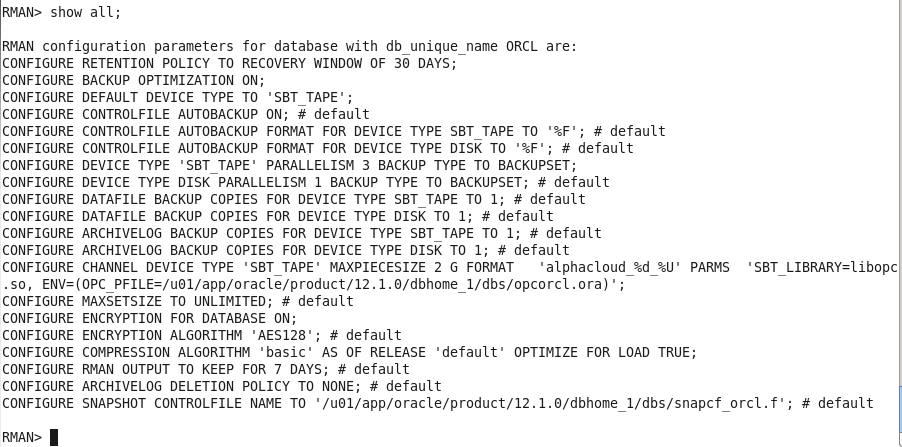
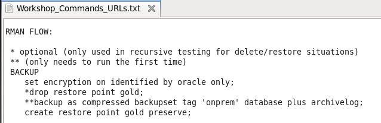
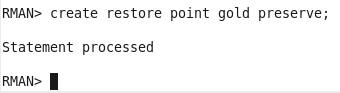
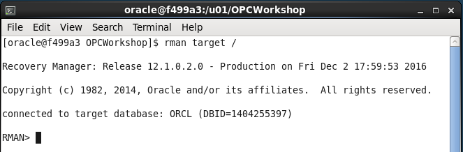
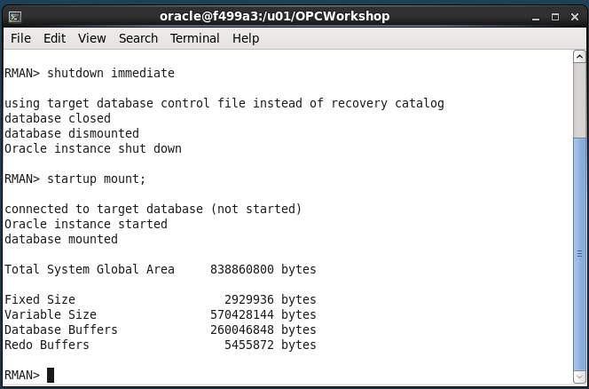
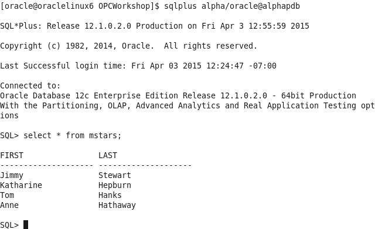

-   Verify the required files have been created by entering the
    following commands

**$ ls $ORACLE\_HOME/lib/libopc\* **

**$ ls $ORACLE\_HOME/dbs/opc\***

#### **Configure RMAN to support Cloud Backups**

Before we can do backups to the Cloud storage location in your account,
you need to configure a number of RMAN properties. These properties
define:

-   How long to retain the backups (30 days)

-   Setting up a device type called “sbt\_tape” that uses the library
    and config files you just installed.

-   Note that any defined storage chunks in the cloud will have names
    starting with “alphacloud\_”

-   Turning on Encryption for data security. This is mandatory for an on
    premise to cloud backup scenario

-   Set a degree of parallelism so that the backup/restore uses
    multiple threads. This is for performance.

-   Setting backup optimization to ON so that RMAN will not
    unnecessarily transfer data to and from the cloud. (e.g. If a backup
    file is already present and has not had any changes before a “new”
    backup is performed, this file will not be dealt with, saving time).

-   Setting a compression level for the files going to/from the cloud

-   Configuring the sbt\_tape device as the default for all backups

<!-- -->

-   Connect RMAN to our local database using **rman target /**

-   Commands in RMAN can be run in blocks so you can do a sequence all
    at once.

<!-- -->

-   **Copy and Paste** from the entire run block in
    **Workshop\_Commands\_URLS.txt** under the **RMAN Config Params**
    section as shown below:

-   Hit Enter and the parameters will be set to the following:

-   Verify the changes in RMAN by typing **show all;**

#### **Backup the On Premise Database**

For backup and recovery we would usually run the following sequence of
commands from a shell script or an RMAN run block, but for lab
illustration purposes we’ll copy and paste each individual command in
sequence so you can get a better feel for what is going on.

-   Under the **RMAN FLOW BACKUP** section of the
    **Workshop\_Commands\_URLS.txt file Copy the first line under the
    word BACKUP and paste it into your RMAN terminal session.**

-   RMAN&gt; set encryption on identified by oracle only;

-   For security reasons, backing up to the Oracle Public Cloud requires
    that encryption is used. The options are Transparent Data
    Encryption (TDE) and/or password encryption. We will be using
    password encryption in this lab.

<!-- -->

-   Copy and Paste the backup command (minus the asterisks)

<!-- -->

-   backup as compressed backupset tag 'onprem' database plus
    archivelog;

<!-- -->

-   The backup will commence. Depending on the speed of your network the
    backup job will take just a few minutes. The database control files
    and SPFILE are the last part to be backed up.

**NOTE:** If for some reason your backup does not finish properly
because of network issues, there is a way to clean up the partial backup
files and retry. This procedure is documented in the **Appendix** at the
end of this lab.

-   When creating a backup, the file chunks are placed in a user defined
    storage container in your account, OR they will be in a system
    generated container called **oracle-data-storage-xxx**. We can
    verify that the backup actually went to the cloud once the backup
    command has completed.

<!-- -->

-   You can use the RMAN list backup summary command to verify the
    backup files. Type the following command into the RMAN
    terminal session.

-   list backup summary;

-   Enter the following command at the RMAN prompt**:**

-   create restore point gold preserve;

#### **Oops…**

-   Now that we have a backup of our database we are going to
    “accidently” drop a table that will reappear once we perform
    the restore.

<!-- -->

-   Open up a new Terminal Window and use SQL\*Plus to connect to the
    **alpha schema** in the local AlphaPDB container database.

$ sqlplus alpha/oracle@alphapdb

-   There is a table called **mstars** in the schema. Query the table to
    view the contents.

$ select \* from mstars;

-   Drop the table with the drop table command

SQL&gt; drop table mstars;

-   Exit SQL\*Plus

<!-- -->

-   SQL&gt; exit;

    1.  #### **Restore and Recover the Database to a Point in Time**

<!-- -->

-   In order to recover from the accidental table drop, we now need to
    restore the database to the point in time before the mstars table
    was accidentally deleted. We’ll use the cloud backup files to
    perform this restore.

<!-- -->

-   Open the RMAN session you used in the previous steps. If you’ve
    exited out of RMAN, it can be started again by entering the
    following within a terminal window:

$ rman target /

Type the following commands to ready the database for a media recovery.

RMAN&gt; shutdown immediate;

RMAN&gt; startup mount;

-   The next few steps will bring the entire database to a point where
    media recovery can occur. This takes the database offline. If you
    had multiple PDBs in the database and only needed to recover data in
    one PDB while leaving the others on-line, you could use the steps
    listed in the **ALTERNATIVE RESTORE** section in
    W**orkshop\_Commands\_URLS.txt under the RMAN FLOW heading. It takes
    a little longer using the ALTERNATIVE RESTORE method, so we’ll use
    the flow under the RESTORE section.**

<!-- -->

-   Set the decryption user name by typing or copying the following
    command from within the RESTORE section of the
    Workshop\_Commands\_URLS.txt file.

RMAN&gt; set decryption identified by oracle;

-   **Copy the run block and Paste it into** the RMAN terminal session.
    The run command will perform the restore / recovery to our “gold”
    restore point. The final step opens the database and resets the logs
    since we’ve restored to a previous point in time.

RMAN&gt; run {

restore to restore point gold database;

recover database to restore point gold;

alter database open resetlogs;

}

-   Press Enter and the commands will be executed:

-   Once the script completes, return to the Terminal Window that was
    used to connect with SQL\*Plus and connect back into the AlphaPDB
    container as alpha/oracle and run a query to see if the mstars table
    has been recovered.

$ sqlplus alpha/oracle@alphapdb

SQL&gt; select \* from mstars;

This concludes lab 3 – Backup and Recovery. Proceed to the next lab when
you’re ready.

**Appendix**

-   In case your backup does not complete properly you can clean up the
    partial backupset and rerun the backup. You may have to wait a few
    minutes after the backup failure before the partial backup files can
    be deleted.

<!-- -->

-   Start up RMAN and type:

<!-- -->

-   RMAN&gt; delete noprompt backupset tag ‘onprem’;

<!-- -->

-   Rerun the backup

<!-- -->

-   RMAN&gt; backup as compressed backupset tag 'onprem' database plus
    archivelog;

