Oracle Data Management Cloud Workshop

Database Cloud Service

Updated: XXX 0, 0000

**Safe Harbor Statement**

The following is intended to outline our general product direction. It
is intended for information purposes only, and may not be incorporated
into any contract. It is not a commitment to deliver any material, code,
or functionality, and should not be relied upon in making purchasing
decisions.

The development, release, and timing of any features or functionality
described for Oracle’s products remains at the sole discretion of
Oracle.

**Oracle Training Materials – Usage Agreement**

Use of this Site (“Site”) or Materials constitutes agreement with the
following terms and conditions:

1. Oracle Corporation (“Oracle”) is pleased to allow its business
partner (“Partner”) to download and copy the information, documents, and
the online training courses (collectively, “Materials") found on this
Site. The use of the Materials is restricted to the non-commercial,
internal training of the Partner’s employees only. The Materials may not
be used for training, promotion, or sales to customers or other partners
or third parties.

2. All the Materials are trademarks of Oracle and are proprietary
information of Oracle. Partner or other third party at no time has any
right to resell, redistribute or create derivative works from the
Materials.

3. Oracle disclaims any warranties or representations as to the accuracy
or completeness of any Materials.  Materials are provided "as is"
without warranty of any kind, either express or implied, including
without limitation warranties of merchantability, fitness for a
particular purpose, and non-infringement.

4. Under no circumstances shall Oracle or the Oracle Authorized Delivery
Partner be liable for any loss, damage, liability or expense incurred or
suffered which is claimed to have resulted from use of this Site of
Materials. As a condition of use of the Materials, Partner agrees to
indemnify Oracle from and against any and all actions, claims, losses,
damages, liabilities and expenses (including reasonable attorneys' fees)
arising out of Partner’s use of the Materials.

5. Reference materials including but not limited to those identified in
the Boot Camp manifest cannot be redistributed in any format without
Oracle written consent.

## Contents

- Oracle Page
- [Section 1: Database Cloud Service Overview](#1.-Section-1:-Database-Cloud-Service-Overview)
   - 1.1: Introduction
   - 1.2: Objectives
   - 1.3: Lab Requirements
   - 1.4: Retrieve Public IP for Client Image
   - 1.5: Create Database Cloud Service Instance
   - 1.6: Configuration and Image Exploration
- [Section 2: Cloud Migration](#Section-2:-Cloud-Migration)
   - 2.1: Introduction
   - 2.2: Objectives
   - 2.3: System Requirements
   - 2.4: Cloud Migration Using Pluggable Databases
   - 2.5: Cloud Migration Using Data Pump
   - 2.6: Cloud Migration Using SQL Developer Carts
- [Section 3: Backup and Recovery](#Section-3:-Backup-and-Recovery)
   - 3.1: Introduction
   - 3.2: Objectives
   - 3.3: Lab Requirements
   - 3.4: Oracle Public Cloud Backup Recovery
- [Section 4: Database Development](#Section-4:-Database-Development)
   - 4.1: Introduction
   - 4.2: Objectives
   - 4.3: Lab Requirements
   - 4.4: Alpha Office and APEX
 

1.  Section 1: Database Cloud Service Overview 
    ================================

    1.  ### Introduction

This lab will help give you
a basic understanding of the Oracle Database Cloud Service and it’s
capabilities around administration and database development.

We will walk through creating a new Database Cloud Service instance.
After the database has been created, you will connect into the Database
image using an SSH private key and familiarize yourself with the image
layout. Next you will learn about SSH tunneling using an SSH
configuration file. This file will be used to tunnel multiple ports to a
remote OPC instance. Using the tunnels, you will learn how to access
various Database consoles.

### Objectives

-   Create Database Cloud Service

-   Configure security with SSH

-   Explore VM and cloud consoles

    1.  ### Lab Requirements

<!-- -->

-   VNC Viewer to connect to an Image running on Oracle’s IaaS
    Compute Service.

-   Laptop capable of connecting to the internet and running VNC Viewer

-   Cloud environment access details provided by instructor in advance
    of the class

**Note:** *Use the table below and fill in the blanks as you go through
the labs. Create a text file or note on your VNC desktop to keep track
of important information you’ll need throughout the lab exercises so
that you can easily copy and paste the information.*

| Cloud Data Center:                      |     |
|-----------------------------------------|-----|
| Identity Domain:                        |     |
| Login Username (s):                     |     |
| Login Password:                         |     |
| Alpha01A-DBCS Cloud Public IP Address:  |     |
| Alpha01A-DBCS Cloud Private IP Address: |     |
| Site Location ID:                       |     |
| Alpha01B-DBCS Cloud Public IP Address:  |     |
| Alpha01B-DBCS Cloud Private IP Address: |     |
| Client Public IP Address:               |     |
| Client Private IP Address:              |     |
| VNC Viewer Port \#:                     |     |
| Client Image VNC Viewer Password:       |     |

### Retrieve Public IP for Client Image

For the Database Cloud Service Workshop we will be using a Client Image
running in the Oracle Compute cloud to simulate the on premise
environment. This client image is running Linux and contains a
preinstalled Oracle 12.1.0.2 database with a pluggable database that we
will migrate to the Oracle Public Cloud Database instance. The client
image contains SQL Developer 4.1, SQL\*Plus and other utilities that
will be used to connect and manipulate both the local and cloud database
instances.

The Client Image is a VM that is running on Oracle’s IaaS Compute
service.

#### **Retrieve Public IP for Client Image**

-   Login to your Oracle Cloud account

-   Open a browser and go to the following URL: https://cloud.oracle.com

-   Click **Sign In** in the upper right hand corner of the browser

-   Under My Services &gt; Select Data Center … select the region from
    the drop down list. Your instructor will provide this information to
    you prior the course.
    
 

<!-- -->

-   Enter the **identity domain** and click **Go**

-   After entering the Identity Domain you will enter the User Name and
    Password

-   Click **Sign In**

**NOTE**: The **Identity Domain, User Name** and **Password** values
were provided to you by your instructor prior to starting this lab.

-   You should see the Dashboard summarizing all of your
    available services. Compute, backup, and storage are all related to
    the Database Cloud Service.

-   If there’s a service that’s not visible, **click** on the
    **Customize Dashboard dropdown** and add each service as a
    **favorite** by clicking on the **Show button** next to the service.

-   From the main dashboard, click on the **Compute** service link to
    access the Compute Service Console. This is where we will get the IP
    address of our database service.

-   From this page you can view general information about this Compute
    Cloud Service. Click on the **Open Service Console** button.

-   The Compute Service Console will give you a summary of the resources
    your cloud service is using and a list all running VM’s.

-   Identity Domains have multiple sites. If you don’t see your VM
    images in the Compute Console, you may be in the wrong site.

-   Please ask your instructor which site the Client Image is
    running on. If necessary, click the **Site** dropdown at the top of
    the page to access the **Site Selector** and choose the
    correct site.

-   Once the correct site has been selected, locate the instance named
    **ClientImage01** and copy the **Public IP. **

-   **Note: Keep this IP Address somewhere accessible, like a notepad or
    text document. We will use this IP with VNC to connect to the cloud
    client desktop.**

#### **Connect to Client Image using VNC Viewer**

-   From your desktop run the VNC Viewer application and enter the
    Public IP address you just obtained, with a display port **separated
    from the IP address by a colon &lt;:443&gt;** and click **Connect**

***Note 1:** If connecting inside an Oracle office through the
‘clear-guest’ network, and the VNC session won’t connect or times out,
try port :10.*

**Note 2:** If you do not already have a VNC Viewer installed on your
computer you will need to download it. Or ask the instructor for the
Real VNC Viewer executable.

-   Click Continue on the encryption message.

-   Enter the password supplied by your instructor and click **OK**

-   Verify that you can see and interact with the Linux desktop. You are
    now connected to the Client Image that will be used for all labs.

> 

1.  ### Create Database Cloud Service Instance

    1.  #### **Login to your Oracle Cloud account**

-   From within the VNC Session open the **Google Chrome browser**
     and go to
    the following URL:
    [**https://cloud.oracle.com**](https://cloud.oracle.com)

<!-- -->

-   Click **Sign In** in the upper right hand corner of the browser

<!-- -->

-   Under the Cloud Account field click on the Select Data Center drop
    down, choose the data center location (for demos and trials, it’s
    usually EMEA) then click on the My Services &gt; button.

**IMPORTANT** - Under My Services, the **Data Center location** is
provided to you in the *lab connection instructions*.

-   In the next screen enter the **identity domain** and click **GO**

-   Enter the cloud User Name and Password and click **Sign In**

**NOTE**: The **Identity Domain, User Name** and **Password** values are
provided in the *lab connection instructions*.

-   You should see the Dashboard summarizing all of the
    available services.

#### **Create Database Cloud Service**

-   From the main dashboard, click on the ***Database*** service link

-   From this page you can view general information about this Database
    Cloud Service. Click on the **Open Service Console** button.
    ---**Stop here**

-   From the console, click the **Create Service button**

-   ***Note:** There should already be a service
    provisioned (Alpha01A-DBCS). It was created earlier in order to save
    lab time. This service will be utilized later in the lab, don’t
    interact with it at this point.*

 Important Step!
In the next steps, you will provide identity service configuration
details and select the compute shape for your new Database instance.

**Note:** Service Name must be unique. When providing a name, please
note you may have another service instance already created in your
account.

-   Use the information from the following table for the Service
    Configuration details:

| **Basic Service Information** |
|-------------------------------|
| **Service Name**              |
| **Description**               |
| **Service Level**             |
| **Metering Frequency**        |
| **Software Release**          |
| **Software Edition**          |
| **Database Type**             |

*Below are examples of the alternate selections for each*

-   Your screen should look like this …

-   Click **Next** to continue

<!-- -->

-   In the next screen we will fill out the **Service Details** for our
    Database Cloud instance. The screen will be broken down into
    sections to make the information easier to understand.

<!-- -->

-   Here is an example of the completed Service Details Screen. Continue
    to the next step for details on how to fill this form in correctly.

Section 1: Database Configuration:

| **Section 1: Database Configuration ** |
|----------------------------------------|
| **DB Name (SID)**                      |
| **PDB Name**                           |
| **Administration Password**            |
| **Usable Database Storage (GB)**       |
| **Total Data File Storage (GB)**       |
| **Compute Shape**                      |
| **SSH Public Key**                     |

**Note: The SSH Key has already been created for you. It’s named
labkey.pub and can be found on the client image under
/u01/OPCWorkshop/lab/ **

-   On the SSH Public Key section, click Edit

-   **Click on the Edit button to browse for the labkey.pub **

-   **Make sure the Key File name: radio button is checked and click
    Choose File**

-   **Navigate to the following subdirectory on your system:
    /u01/OPCWorkshop/lab/**

-   **Choose the file named labkey.pub**

-   Click Open and confirm that labkey.pub is shown on the screen

-   Click **Enter** and continue filling out the Details form. Continue
    on to the **Backup and Recovery** and **Initialize Data From Backup
    Configuration** Sections

-   Use the information from the following table to help fill out the
    **Backup and Recovery Configuration** and **Initialize Data From
    Backup** sections.

| **Backup and Recovery Configuration Information ** |
|----------------------------------------------------|
| **Backup Destination**                             |
| **Cloud Storage Container**                        |
| **Cloud Storage Username**                         |
| **Cloud Storage Password**                         |
| **Create Cloud Storage Container**                 |
| **Total Estimated Monthly Storage (GB)**           |
| **Create Instance from Existing Backup**           |

**Note**: By checking the box labeled - **Create Cloud Storage
Container**, if the container does not exist it will be created
automatically. This will be the location for all backups

-   Confirm the following information from the **Advanced
    Settings** section. This information is default and doesn’t need to
    be altered.

-   After all fields have been filled out , click on **Next**

-   Review the Confirmation screen and confirm that your entries
    are correct. When you’re satisfied that everything is in order click
    **Create. **

-   You should be returned to the dashboard and your new Database Cloud
    Service instance **Alpha01B-DBCS should be visible and labeled as
    ‘In Progress’**

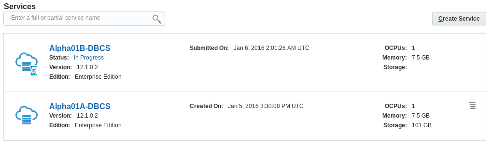

-   The creation of the DBCS instance will take approximately
    20 minutes. While your DBCS instance is being created, you can view
    the current status clicking on the **In Progress** link.

**NOTE**: To save time we will continue with the lab by utilizing
**Alpha01A-DBCS** DBCS instance already created. Alpha01A-DBCS was
created following the exact steps you just performed.

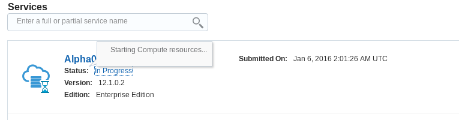

1.  ### Configuration and Image Exploration

    1.  #### **Record the IP address of the Database Cloud Service**

In the following steps you will record the IP addresses of the Virtual
Machine on which the cloud service runs and configure SSH connectivity
to **Alpha01A-DBCS**. Then you will access the different monitoring,
configuration, and development consoles available on Oracle Database
Cloud Service.

-   Click on **Alpha01A-DBCS** link or cloud icon from the list of
    Database Instances to get further details on Alpha01A-DBCS

-   Note the Public IP address of **Alpha01A-DBCS**. In the below
    example the address is 140.86.12.71, yours will be different.

#### **Create the SSH configuration file and start tunnels**

For obvious reasons the default Oracle Public Cloud network
configuration is very secure. Customers can open individual ports to the
various servers in the cloud environment through the Compute Cloud
Service Console or they can create SSH tunnels to the specific
server/port combinations as needed.

In this section we will use **SSH Tunnels** to communicate securely
between the client and the Cloud Database instance. We have built a
**script that automatically creates these tunnels for you.** You will
review the script later in the exercise so you can learn how to create
them on your own.

We will show you how to use secure tunnels as well as how to open ports
for the following exercises.

In step 1.6.2 you will run the script that creates and configures an SSH
file that will be used to connect to your various servers. Once the SSH
file is created, it is used as a script to create the SSH tunnels in the
background with connections to selected ports used in this and other
labs.

-   Open a terminal Window using the Utilities menu or by clicking the
    terminal icon.
    

<!-- -->

-   Change into the lab directory **cd lab**

-   Run the SSH script to open the ports. Type **./setssh.sh DBONLY** in
    the terminal window

-   **If you make an error you’ll see:**

-   Enter the Cloud Database IP address obtained in Step 1.6.1 and.
    Click **OK**.

The script will try a test connection to your server. If successful, an
SSH configuration file is created and an SSH session to the DB server
will be started in the background.

If the script encounters any problems, or you entered the wrong address,
you will be re-prompted to enter the IP address.

If the tunnels are created successfully you will see a Success
Information Dialog.

-   Click OK on the dialog box to clear it.

**Note:** Do not close the terminal window that you used to run the SSH
Configuration script. Closing the terminal window will shut down the
background SSH tunnel processes. If you accidentally shut the terminal
window, you can start over again at step 1.6.2 and run the script again.
You might want to minimize this terminal window until you need to stop
the tunnels.

-   Examine the script to view and understand the commands used to start
    the tunnels.

<!-- -->

-   Type **gedit** myssh in the terminal window

Notice under the **Host AlphaDBCS** section of the configuration file
that the DBCS IP address has been inserted in 5 areas defining
LocalForward ports (1526, 443, 4848, and 5500). Which correspond to host
direct access, MySQL, APEX, DB Monitor, Glassfish, and Enterprise
Manager. These ports can now be accessed locally using “localhost” in
connection information or URLs.

**Tunneling Script Example:**

-   Close the edit session.

-   Type **ps -ef | grep DBCS** to see the background session created.

#### **Explore DB image via SSH**

In the previous step, you started SSH tunnels in the background for
access to development tools and the browser. In this step we will
demonstrate how to do an explicit SSH connection to your DB cloud
server.

-   Enter the below command in the same terminal window you ran the
    setssh.sh script, using the Public IP address of your DBCS
    cloud instance.

-   $ ssh -o StrictHostKeyChecking=no -i ./labkey
    oracle@&lt;**your-DB-Public-IP**&gt;

After successfully connecting to Alpha01A-DBCS you can browse the image.

-   Issue a **df** command to see mounted disks and existing space.

-   $ df -h

-   View the Database environment variables.

<!-- -->

-   $ **env | grep ORA**

-   Change directories to the Oracle Home and list the directories.

-   $ **cd $ORACLE\_HOME**

-   $ **ls**

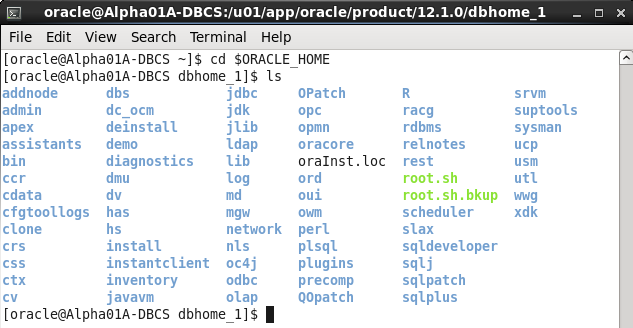

Type **exit** once to close the session.

$ exit

**NOTE:** By typing exit once, you are exiting the Cloud DBCS Service
SSH session. If you are running commands in the same window you started
the SSH tunnel scrip in and you type exit twice you will exit the
terminal window and you will terminate the SSH tunnels. Do not exit the
Terminal window, these SSH Tunnels will be used during the remainder of
the lab. Feel free to minimize the SSH Tunnel terminal and start a new
one to avoid accidentally closing the tunnels.

#### **Access the Compute Cloud Service and open SSH ports for access.**

**NOTE:** For any of the URLs mentioned in this section you can also use
the predefined browser links. If blocked ports on the network cause an
issue loading any of these consoles, the predefined browser links will
help by routing the traffic through the SSH tunnel that should already
be open:

To gain access to the various consoles used by the Database Cloud
Service you have two options. You can open up the port on which the
monitor is listening, or you can create an SSH tunnel to the specific
server/port combinations as needed. We have already created the SSH
tunnels and those will be used to access the consoles we need for this
lab.

In this step you will open the port 443 on the VM using a pre-created
access rule and protocol definition.

-   Return to your Cloud.oracle.com session on the Google browser. If
    you’ve logged out for any reason, log back into the cloud account
    using the details at the start of the lab.

-   Click the header menu in the upper left next to Oracle Cloud My
    Services and choose the Compute Cloud console

-   Click on **Compute Cloud Service Console** menu item

-   Verify that you’re on the correct site and that the Alpha01A-DBCS
    and Alpha01B-DBCS instance are visible.

-   From the top menu bar click on **Network** tab.

The Network section will allow you to manage security access, IP
networking, and SSH information. There can be many entries so we’ll
filter out what we’re looking for.

-   With the Security &gt; Security Rules section selected, type
    **httpssl** into the search box and hit enter or click the
    magnifying glass icon.

**Note:** If you can’t see the particular rule clearly, widen your
browser screen or click on the table icon to change the view.

-   For each instance there is an httpssl rule called
    ‘**ora\_p2\_httpssl’. **

-   **To change the rule for the Alpha01A-DBCS** instance click on the
    **hamburger menu**
     or on the
    colored arrows and select **Update**

-   Change Status to **Enabled** and click **Update**

-   Notice the status change for the **ora\_p2\_httpssl** Access rule to
    **Enabled**. The port is now open and can be accessed without the
    tunnels if necessary.

-   Navigate back to the **Database Cloud Service Console** by clicking
    the header icon and selecting **Database Cloud Service**.

-   For the **Alpha01A-DBCS** instance click the **hamburger menu**
     and select
    **Open DBaaS Monitor Console.**

-   You will likely get a security warning, click **ADVANCED** followed
    by **Proceed to &lt;your IP Address&gt; (unsafe)**

-   Login to the DBaaS monitor

| **User Name:** | dbaas\_monitor |
|----------------|----------------|
| **Password:**  | Alpha2014\_    |

-   Once connected to the Database Monitor Console, feel free to explore
    the various screens. Click on the header items to familiarize
    yourself with DBaaS monitor.

-   Logout when finished

#### **Access Enterprise Manager DB Express**

-   On the browser, open a new tab and **enter** the following **URL**
    to access the **EM Express** page. The first time the URL is used,
    it can take a minute for the console to load.

**Note**: The setssh.sh script that you ran earlier in this lab created
the ssh tunnel which routes all traffic over localhost:5500 to the
database cloud service.

-   **https://localhost:5500/em**

-   If you get a security warning, click **ADVANCED** followed by
    **Proceed to localhost (unsafe)**

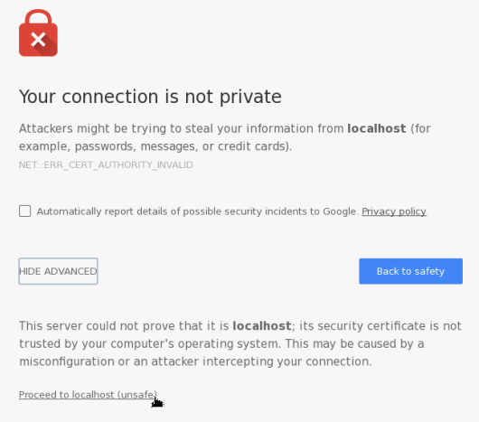

-   On the EM login page enter the following and click on **Login**:

| **User Name:** | sys         |
|----------------|-------------|
| **Password:**  | Alpha2014\_ |
| **Checkbox:**  | “as sysdba” |

-   Click on different items on the Enterprise Manager console to get
    familiar with its capabilities.

-   Logout when finished.

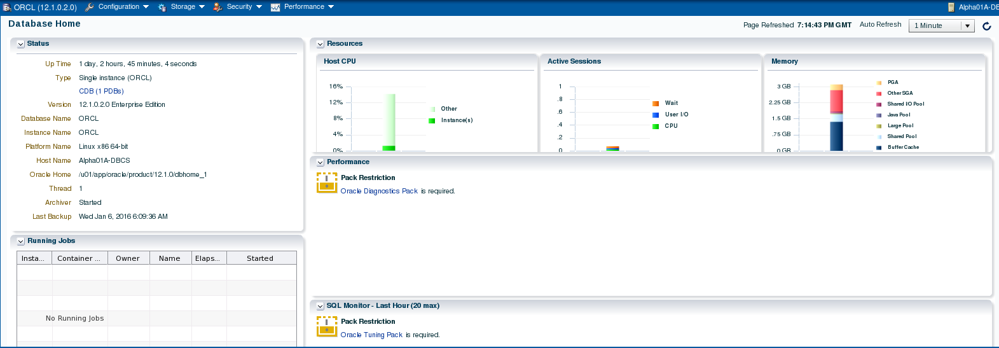

#### **Access Apex Monitor**

-   Enter the following URL into a browser window to access the **Apex
    console** (click to add a security exception if necessary).

**Note**: All traffic to the default https port (443) on local host is
also routed through the SSH tunnel to the database cloud service.

-   **https://localhost/apex/pdb1/**

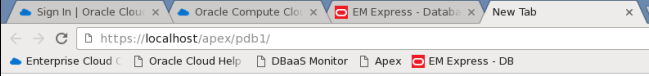

-   If you get a security warning, click **ADVANCED** followed by
    **Proceed to localhost (unsafe)**

-   Once the Apex login window is displayed, **enter the following** and
    click on **Sign In**:

| **Workspace:** | internal    |
|----------------|-------------|
| **Username:**  | ADMIN       |
| **Password:**  | Alpha2014\_ |

-   You are now connected to Apex. Feel free to explore the various
    menu options. The last lab in this workshop will walk you through
    the creation of a simple application.

-   Log out of APEX when you are finished.

-   This concludes the first lab, Overview of DBCS. Proceed to the next
    lab when ready.

Section 2: Cloud Migration
===============

    2.  ### Introduction

In this lab you will explore some common methods for moving data from on
premise to the cloud. There are multiple options for solving this data
movement challenge. In this lab we will use SQL\*Developer and command
line tools to clone and move a pluggable database from an on premise
database (in the provided Virtual Machine) to a cloud database. We will
also use standard Oracle Data Pump tools to export a schema from the on
premise database, and then import that data to a cloud database in a new
schema. The final exercise will use the SQL Developer cart feature to
quickly move data from the local database to the cloud using only the
privileges of a normal schema owner.

### Objectives

-   Clone, unplug, transfer, and plug the AlphaPDB pluggable database
    using SQL Developer.

-   Export and import a schema using SQL Developer to execute Oracle
    Data Pump jobs.

-   Export and import a small collection of tables using SQL Developer.

    1.  ### System Requirements

<!-- -->

-   VNC Viewer for connection to client system

-   Successful completion of Section 1: Database Cloud Service
    Overview lab.

-   The SSH tunnels must be active in a terminal window in the client
    system

    1.  ### Cloud Migration Using Pluggable Databases

In this section of the lab we will prepare the on premise environment
and create connections. Then we’ll clone the database. We’ll create SSH
connections to the cloud instance and finally we’ll copy the clone to
the public cloud using Oracle SQL Developer. Once the database has been
cloned we will patch the instance to bring it up to date with the Cloud
Container database. We will verify successful patching and login in to
the newly migrated Database instance.

#### **Configure the Environment**

-   From the VNC Session desktop, locate and double-click on the
    **StartDB** icon**.** It will take a minute for the Database to
    fully start. Once started, the Terminal Log Window will
    automatically close.

-   From the VNC Session desktop, locate and double-click on the **SQL
    Developer** icon. We will use SQL Developer to connect to the on
    premise database.

**NOTE:** The first time SQL Developer is brought up, it may a few
minutes to start up.

-   Double-click the **On-premise** folder or click on the plus sign
    next the folder to expand the list of database connections. Please
    note the pre-configured connections to the on-premise database,
    Alpha – PDB, sys- AlphaPDB and sys-CDB.

-   Select the **View** -&gt; **DBA** menu option from the top dropdown
    menu to open up the DBA navigator panel.

-   On the DBA panel, click the green plus icon to create a
    new connection.

**Note**: you can also right-click on the green plus sign under
Connections and select Add Connection.

-   Select the **sys - CDB** connection and click **OK**.

**Note:** “sys – CDB” is the on premise database located on the virtual
client Image.

-   Expand the **sys - CDB connection by double clicking or by clicking
    on the plus sign,** then expand the **Container Database**
    tree item. Click on the **ALPHAPDB** pluggable database item and
    view the details for the pluggable database.

#### **Clone the ALPHAPDB**

-   In the DBA Navigator
    panel, right click on the ALPHAPDB pluggable database and select the
    **Clone Pluggable Database…** menu option.

-   Enter the following: Database Name: **ALPHACLONE**

-   Select **Custom Names** from the File Name Conversions section and
    review the Source File names. Note the name "**/AlphaPDB/**" for the
    directory of the source file names. For a successful cloning
    operation, we must create new target files that are different than
    the source files.

**Note**: At this point we could manually change all the target files to
point to a different directory, but following are directions for an
easier way to do this.

-   Select **Custom Expressions** from the File Name Conversions
    drop down.

-   Click the **green plus icon**

-   Enter the source directory portion we want to change, followed by
    the target for the new files. Use the information from the table
    below being sure to use the indicated upper and lower case letters:

| **Source File Pattern** | AlphaPDB   |
|-------------------------|------------|
| **Target File Pattern** | AlphaClone |

-   Review the SQL statement by clicking on the SQL tab - note the
    **FILE\_NAME\_CONVERT** clause mapping the existing files to new
    files in a new directory.

-   Click the **Apply** button.

-   SQL Developer shows the action in-progress message for roughly 1-2
    minutes followed by a success message.

-   Click **OK** on the success message.

-   Click on the **ALPHACLONE** database in the DBA navigator to see the
    status of the database.

**Note**: the cloned database shows an **OPEN\_MODE** of **MOUNTED**
indicating the database is plugged-in but is not open for access.

-   Click on the **Data Files** tab for the ALPHACLONE to review the
    data files created during the cloning operation.

#### **Create SSH Host**

In this section you will create SSH and SYS database cloud connections.

In the following steps you will record the IP addresses of the Virtual
Machine on which the cloud service runs and configure SSH connectivity
to **Alpha01A-DBCS**. Then you will access the different monitoring,
configuration, and development consoles available on Oracle Database
Cloud Service.

-   If you haven’t already noted down from the last lab, determine the
    Public IP address of Alpha01A-DBCS as we’ll be using that IP to set
    up our SSH connection for the data migration exercises.

<!-- -->

-   Open a browser and login to cloud.oracle.com using the credentials
    provided by your instructor.

-   Click on the hamburger menu at the top right of the Database service
    section in the Dashboard and choose “**Open Service Console**”

-   Click on **Alpha01A-DBCS** from the list of Database Instances

-   Note the Public IP address of **Alpha01A-DBCS**. The IP address for
    your lab will be different than the one in the below screenshot.

-   Now we can setup an SSH host connection to the Database Cloud
    Service instance.

<!-- -->

-   Return to SQL Developer. From the top menu select **View -&gt; SSH**
    to display SSH hosts panel on the left.

-   Right click on **SSH Hosts** and select **New SSH Host**.

Enter the following information to configure the SSH connection to the
DBCS instance

| **Name**     | **Alpha01A-DBCS**              |
|--------------|--------------------------------|
| **Host**     | **Public IP of Alpha01A-DBCS** |
| **Username** | oracle                         |

-   Select **Use key file** and click **Browse...** Select file
    **/u01/OPCWorkshop/lab/labkey** and click **Open**.

-   Click **Add a Local Port Forward** and enter the following values:

| **Name**                    | Database                       |
|-----------------------------|--------------------------------|
| **Host**                    | **Public IP of Alpha01A-DBCS** |
| **Use specific local port** | 1530                           |

**NOTE**: We are using port 1530 since 1521 is already in use for our
local database.

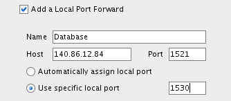

-   Verify the configuration and click **OK**

-   Click the green plus sign
     in the
    Connections window to create a new SQL Developer connection to the
    Public Cloud Database SYS schema

-   Enter the following connection details:

| **Connection Name:** | sys - OPCDBCS                                    |
|----------------------|--------------------------------------------------|
| **Username:**        | sys                                              |
| **Password:**        | Alpha2014\_                                      |
| **Check:**           | “Save Password”                                  |
| **Connection Type:** | SSH                                              |
| **Role:**            | SYSDBA                                           |
| **Service Name:**    | ORCL.&lt;Your Domain ID&gt;.oraclecloud.internal |

***Note:** You can optionally select a color for the connection to
differentiate it from other
connections.*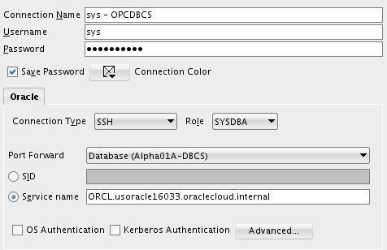

-   Click **Test** to confirm the information was entered correctly.
    Verify that you receive a ‘Success’ status.

-   Click **Connect** to save the connection information which opens a
    new SQL Worksheet.

#### **Copy the Clone Pluggable Database to the Cloud**

In this step we will copy the cloned pluggable database to the cloud
using SQL Developer.

-   Click on **ViewTask Progress** to open up the Task Progress window.

-   In the DBA window expand ‘**sys – CDB**’ and expand ‘**Container
    Database**’, then right-click on **ALPHACLONE** and select “**Clone
    PDB to Oracle Cloud**”

-   Nothing needs to be changed in this window, verify that the default
    properties include your Public Cloud Connection. Click **Apply**.

<!-- -->

-   Source PDB: **ALPHACLONE**

-   Destination Connection: **sys - OPCDBCS**

-   **Action after clone: RePlug**

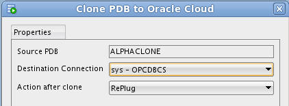

-   You will note in the Task Progress window the progress of moving the
    datafiles over to the cloud database. This task will take about a
    minute to complete.

-   Upon completion of the transfer you will be alerted to at least two
    Plugin Violations. This is because the patch level of the local
    ALPHACLONE pluggable database is different than the Container
    database in the cloud. We will remedy this in the next few steps.

-   Click **OK** for **each** popup.

**Note:** The datafiles will be transferred despite what the pop up
implies.

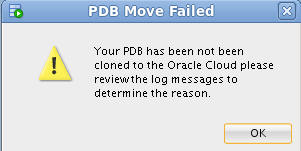

####  **Use EM Express to plug the transferred database**

-   Open Chrome by clicking the icon on the menu bar or the Desktop.

-   Enter the following URL into the Address bar or click the "**EM
    Express - DB**" link in the header bar –
    **https://localhost:5500/em**

**Note:** When using localhost:5500 in the URL below, your browser
request is routed through the SSH proxy that we loaded in a terminal
window in the first lab. If for some reason that window was closed, or
is not working, you should refer to the first lab in step 1.6.2

-   Enter the following login credentials, check the "**as sysdba**" box
    and click the Login button:

| **User Name:** | sys         |
|----------------|-------------|
| **Password:**  | Alpha2014\_ |
| **Check:**     | as sysdba   |

-   We will now plug the Alpha Clone database into the Cloud database.
    From the Database Home page, click the **CDB(1 PDBs)** link.

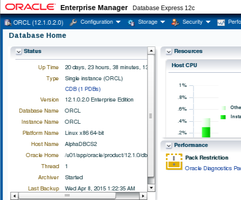

-   Open the **Actions** list and select the **Plug** command

-   Enter the following filename and directory location in the Metadata
    File field in the Plug PDB dialog box.

Metadata File:
**/u02/app/oracle/oradata/ORCL/ALPHACLONE/ALPHACLONE.XML**

-   **Uncheck** the **Reuse source datafile location from Metadata
    File** check box

-   Enter the Source Datafile Location:

Source Datafile Location: **/u02/app/oracle/oradata/ORCL/ALPHACLONE**

-   Click OK

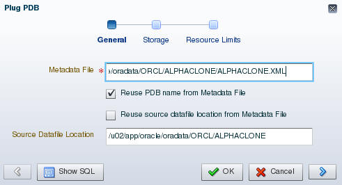

-   The Processing message displays for the 2 minutes (approximately)
    required to plug the database into the container. Click the **OK**
    button when the Confirmation message displays.

|  |     | 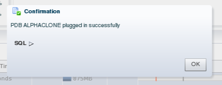 |
|-----------------------------------------------------------|-----|------------------------------------------------------------|

-   Notice the database is now in the list of Containers**. **

**Note: There will be Violations because of the patch level mismatch
between the original source Pluggable database and the Cloud Container
database**.

-   You now need to SSH into the Cloud database server in order to patch
    the database. Example is shown below. Substitute your Cloud database
    server IP address (Alpha01A-DBCS)

-   Open a Terminal and type the following SSH command to connect to the
    cloud database server.

-   ssh -o ServerAliveInterval=60 -i /u01/OPCWorkshop/lab/labkey
    oracle@&lt;Alpha01A-DBCS-IP-address&gt;

-   We’ll need to run the **datapatch script** to apply any
    missing patches. It should run with no errors.

**Note: If it complains the first time about not being able to determine
the current opatch status then wait a minute until it’s had time to pick
up the newly cloned pluggable database and retry.**

-   $ORACLE\_HOME/OPatch/datapatch -verbose

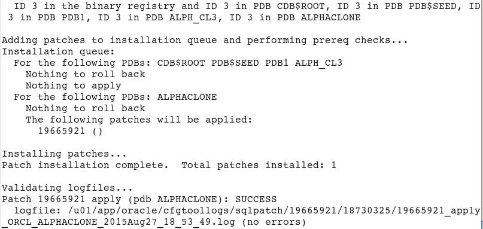

In the next few steps we’ll upgrade the PDB.

**Note:** If you receive an error message like, “**The pluggable
databases that need to be patched must be in upgrade mode**” complete
the following upgrade PDB Step. If not, proceed directly to the next
step (Close and Reopen ALPHACLONE PDB).

-   Put the database in upgrade mode to correct the patch errors.

<!-- -->

-   Connect to container database using SQL Plus and place the database
    in **upgrade mode**. Once completed run **datapatch** again and you
    should have no errors. Run the following commands to complete
    this step.

-   sqlplus / as sysdba

-   alter pluggable database ALPHACLONE close;

-   alter pluggable database ALPHACLONE open upgrade;

-   exit

-   $ORACLE\_HOME/OPatch/datapatch -verbose

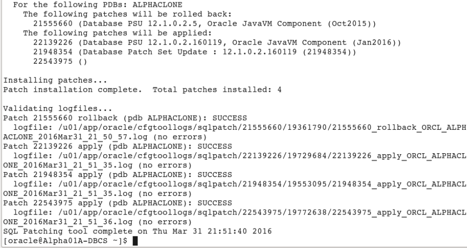

-   **Close and Reopen ALPHACLONE PDB**

<!-- -->

-   The final step is to close and reopen the ALPHACLONE
    pluggable database. Go back to EM Express, with the ALPHACLONE
    row highlighted. (DO NOT CLICK THE ALPHACLONE LINK).

-   Select **Actions Close**.

-   Accept the defaults and Click **OK**.

-   Close the Confirmation pop up by clicking **OK**.

-   Reopen the pluggable database via **Actions Open**.

-   Accept the default to open it Read / Write. Click **OK**.

-   Close the Confirmation pop up by clicking **OK**.

-   Refresh the browser page using the refresh icon in the top
    right corner.

-   Note that the violations are now gone.

-   Click the **ALPHACLONE** container name link to review the
    database information.

#### **Create an SQL Developer connection to the Public Cloud database ALPHACLONE schema**

-   In the SQL Developer application, click the green plus sign
     in the
    Connections window to create a new connection; enter the following
    connection details:

| **Connection Name:** | Alpha Clone – DBCS                                     |
|----------------------|--------------------------------------------------------|
| **Username:**        | alpha                                                  |
| **Password:**        | oracle                                                 |
| **Check:**           | “Save Password”                                        |
| **Connection Type:** | SSH                                                    |
| **Service Name:**    | Alphaclone.&lt;Your ID Domain&gt;.oraclecloud.internal |

***Note:** You can optionally select a color for the connection to
differentiate it from other connections.*

-   Click **Test** to confirm the information was entered correctly.

-   Click **Connect** to save the connection information and open a
    new SQL Worksheet.

-   You have successfully migrated a pluggable database from on premise
    to the cloud. In the next section we’ll migrate data using
    Data Pump.

    1.  ### Cloud Migration Using Data Pump

        1.  #### **Export the Alpha Schema**

The first step will be to create a local Data Pump Directory.

-   In the Connections Tab inside the "On-Premise" folder navigate to
    the **Alpha - PDB Directories** item, right-mouse click and select
    **Create Directory…**

> **Note**: The default Data Pump directory object, DATA\_PUMP\_DIR,
> does not work with PDBs. Data Pump requires an explicit directory
> object within the PDB for exporting or importing schemas or tables.

-   Enter the following values and click **Apply**. Remember to use the
    SQL tab to review the actual DDL statement. Click **OK** to dismiss
    the confirmation.

| **Directory Name:**            | alpha\_backup\_dir (not case sensitive) |
|--------------------------------|-----------------------------------------|
| **Database Server Directory:** | /u01/OPCWorkshop                        |

> **NOTE:** You may receive an error message stating that “An error was
> encountered performing the requested operation:” and that the
> directory cannot be created. To eliminate this error right-click on
> Alpha - PDB and choose Disconnect. Then Reconnect. The error occurs
> because you were connected earlier while performing the UNMOUNT /
> REMOUNT and during the previous “cloning” of the PDB container the
> connection information was lost. Reconnecting will normally solve this
> issue.

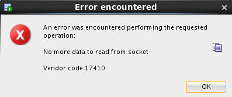

-   Now that we’ve created the Data Pump export directory the next steps
    will outline how to create and run a Data Pump Export job using SQL
    Developer

<!-- -->

-   In the DBA Window, **Add Connection** by clicking on the Green
    Plus sign.

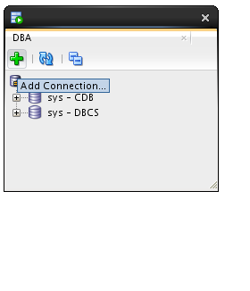

-   Select the **Alpha - PDB** connection and click the **OK** button.

-   Expand **Alpha - PDB**, expand **Data Pump**, then right-mouse-click
    on **Export Jobs,** and then select the **Data Pump Export Wizard…**
    menu item.

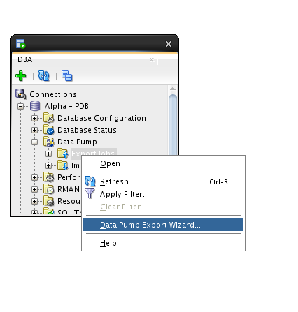

-   Select the **Schemas export** type and click the **Next** button.

-   Select the **ALPHA** schema and use the blue arrow to move it to the
    right-hand column. Click **Next**.

-   We are not filtering out any objects, click the **Next** button.

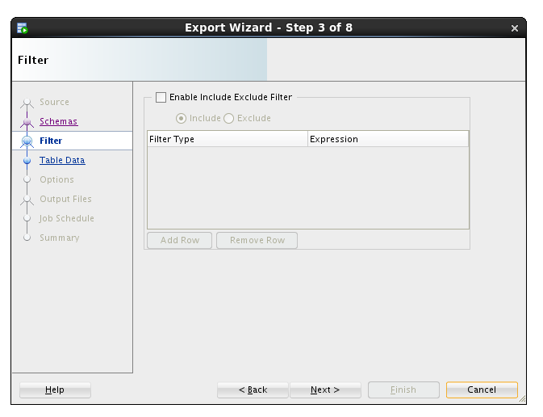

-   We are not applying where clauses to table data, click the
    **Next** button.

-   We want a log for this export, and just like the actual export file,
    we must pick a directory from the list of directories in
    the database.

<!-- -->

-   Select **ALPHA\_BACKUP\_DIR** from the list and click the
    **Next** button.

-   The most important selection for any Data Pump operation is choosing
    the directory where the export file will be written.

<!-- -->

-   Select **ALPHA\_BACKUP\_DIR** from the Directories drop down list.

-   Then, select the **Delete Existing Dump Files** radio button and
    click the **Next** button.

**Note**: Data Pump always uses a server side directory for all export
or import operations.

-   Data Pump jobs can be scheduled to run at any time and on any
    desired times of the day, week or year. We will run the job
    immediately - click the **Next** button.

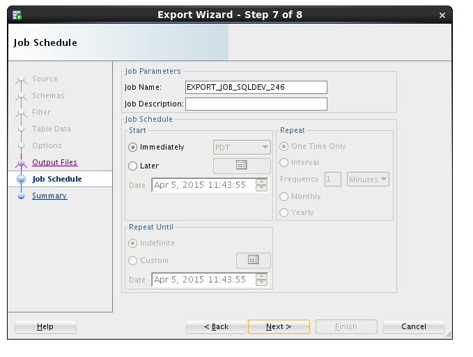

-   On the Summary panel, click the **PL/SQL** tab to review the
    job definition. Review the PL/SQL use of Oracle Supplied PL/SQL
    subprograms for Data Pump. Click the **Finish** button to create
    the job.

|  |  |
|------------------------------------------------------------|------------------------------------------------------------|

-   For a brief time, SQL Developer shows a progress dialog while it
    creates the job in the database.

**Note:** the import actually runs as a job in the database so this
message is only about creating and scheduling the export.

-   While the job is running, you may view status information by
    clicking on the export job added to the DBA Navigator panel. It may
    take a couple of minutes so click the **Refresh**
    icon until
    the job is completed (NOT RUNNING).

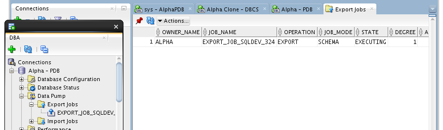

-   Now we’ll copy the export Data Pump file to the server

<!-- -->

-   Start a Terminal window using the top panel icon.

-   Enter the following commands to print the working directory
    (**pwd**), list the directory (**ls**) contents and review the Data
    Pump log file.

$ pwd

$ ls

$ cat EXPDAT.LOG

Use the following secure copy (**scp**) command to transfer the Data
Pump export to the DBCS server. Use the Database Service Private IP
address you identified in the first lab.

$ scp -i lab/labkey EXPDAT01.DMP oracle@&lt;Alpha01A-DBCS public
IP&gt;:~

***Note:** the tilde (~) represents the oracle user's home directory.*

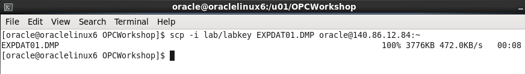

#### **Import Alpha to a new Schema**

-   As we begin the import phase of this example we’ll first create an
    import directory in the Alpha Clone PDB.

<!-- -->

-   Use SQL Developer and expand the **Alpha Clone - DBCS** connection.

-   Right-mouse-click on the **Directories** tree item and select the
    **Create  Directory…** menu item.

-   Enter the following values and click the **Apply** button.

-   Click **OK** to dismiss the confirmation message. This lets the
    database access the same directory where the Data Pump export file
    was copied.

| ***Directory Name:***                                      | alpha\_import\_dir |
|------------------------------------------------------------|--------------------|
| ***Database Server Directory:***                           | /home/oracle       |
| 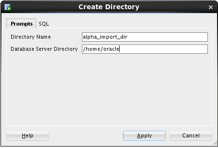 |                    |

-   The next few steps will outline creating the Data Pump Import job.
    To access the Data Pump features, we need to add the clone
    connection to the DBA Navigator.

<!-- -->

-   Click on the green plus sign, Add Connection icon on the DBA
    Navigator panel

-   Select **Alpha Clone - DBCS** connection and click **OK**.

-   Expand **Alpha Clone - DBCS** **Data Pump**

-   Right-mouse on the **Import Jobs** menu item, and select **Data Pump
    Import Wizard…** menu item.

-   Select **Schemas** from the ‘Type of Import box and Choose
    **ALPHA\_IMPORT\_DIR** from the ‘Choose Input Files’ drop down list,
    then click **Next**.

**Note:** This action might take a few minutes. There is some wait time
while the database locates and scans the import file in the selected
directory.

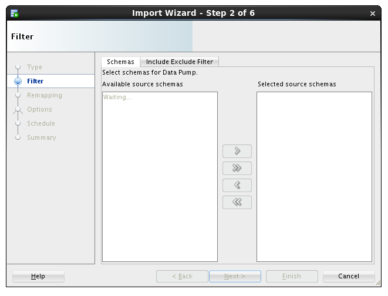

-   Move the **ALPHA** schema from the left to the right column using
    the arrow button and click **Next**.

-   For this lab, we are creating a new schema, so we will enter the new
    schema name as the destination.

<!-- -->

-   Under the Re-Map Schemas section click **Add Row**.

-   Enter the following values and click the **Next** button.

| **Source: **     | ALPHA (should be the default item) |
|------------------|------------------------------------|
| **Destination:** | ALPHA\_COPY                        |

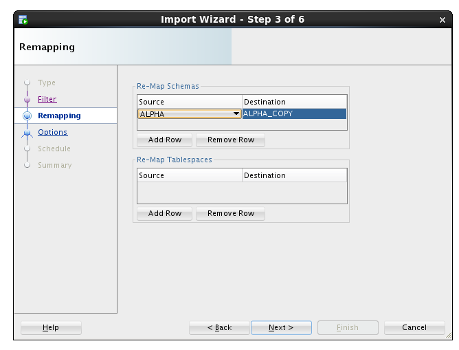

-   We want to see the log output so we will select the same directory
    as the import file directory.

<!-- -->

-   Select **ALPHA\_IMPORT\_DIR** and click the **Next** button.

**Note:** For lab purposes we will execute the import immediately. In
normal operations this job could be set up to refresh a development
database on a daily basis.

-   Click the **Next** button.

-   Click the PL/SQL tab to review the small program that establishes
    the import job. Click the **Finish** button to create the job.

**Note:** For a period of time SQL Developer shows a progress dialog
while the job is being created. The job does not run locally you’re
seeing the progress of creating the job in the database.

-   Locate and click on the job name to see the detailed status as the
    job runs. When the job completes, the database automatically removes
    the job. You will need to use the **Refresh** icon
     to see
    when the job finishes.

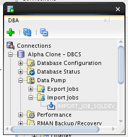

-   If you are interested in verifying that the ALPHA\_COPY schema is
    the same as the ALPHA schema, feel free to create a connection
    and compare.

    1.  ### Cloud Migration Using SQL Developer Carts

        1.  #### **Creating an SQL Developer Cart**

The SQL Developer Cart is a convenient method for organizing the
deployment of database objects and data from one database to another. In
this trivial example, we want to update the data of just the CUSTOMERS
and PRODUCTS table in the development cloud database. More elaborate
usages of the cart can help package entire application deployments,
including pre and post processes from multiple data sources.

-   Show the Cart using the **View** &gt; **Cart** menu option.

-   If Cart\_1 is not already created (it should be), Click on the **New
    Cart** icon.

-   Drag the **CUSTOMERS** table from the **Alpha - PDB** connection to
    the cart.

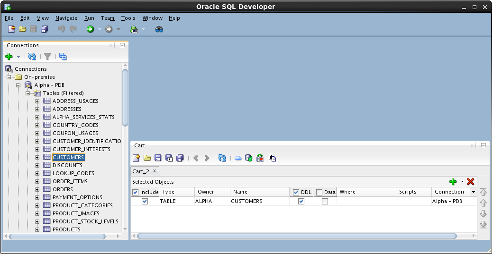

-   Drag the **PRODUCTS** table to the cart.

-   Include a script that runs before any other Cart activity. For this
    lab, we are disabling all the referential integrity constraints so
    we can delete and insert data without regard to foreign keys on
    our tables.

-   In the Cart window click small down arrow next to the **green plus**
    “+” icon and select **Add Initial Script**

-   Click the **Browse…** button.

-   Locate the following file and click **Open**:

/u01/OPCWorkshop/lab/disable-constraints.sql

-   Click **OK**.

-   Click the down arrow next to the **green plus** “+” icon again and
    select **Add Final Script** which is included as the last operation
    performed during the cart operations.

**Note:** There can only be one Initial or Final script in a Cart.

-   Click the **Browse…** button

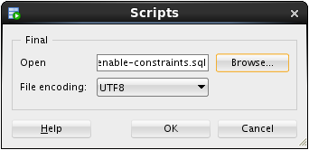

-   Locate the following file and click **Open**:

/u01/OPCWorkshop/lab/enable-constraints.sql

-   Click **OK**.

-   We are not creating any tables in this lab; uncheck the **DDL**
    column heading.

-   We will move the data, include a check the **Data** column heading.

-   Before we can overwrite the new rows in the CUSTOMERS table, we need
    to truncate the table.

<!-- -->

-   Click in the **Scripts** column cell for the CUSTOMERS table and
    then click the **pencil icon**.

-   Check the **Before Load** box, then click the **Browse…** button and
    select the following file:

/u01/OPCWorkshop/lab/truncate-customers.sql

-   Click **OK**:

-   Repeat the operation for the PRODUCTS table; click the **pencil
    icon** on the products row.

-   Click the **Before Load** button, then click on the **Browse**…
    button and select the following file:

/u01/OPCWorkshop/lab/truncate-products.sql

-   Click **OK**:

#### **Export the SQL Developer Cart**

-   Now that the cart is complete, click the **Export Cart** toolbar
    icon to generate the script of all the elements we inserted in
    the cart.

-   Click the **Apply** button to generate script.

**Note:** The selections on this page may be saved and later reused if
the cart is regularly used the same way.

-   If the file already exists, SQL Developer asks you to confirm
    overwriting it with new content. If you see this prompt, click the
    **Yes** button.

-   Review the contents of the script with particular attention to the
    SQL statements that have been inserted based on the scripts
    we included.

-   Run the script by clicking the **Run Script** icon and selecting the
    **Alpha Clone** **— DBCS** connection.

-   Click **OK**.

<!-- -->

-   SQL Developer shows a progress bar while the script runs. Depending
    on your window layout, you may see the command output scrolling by
    while the script runs.

-   When the script is complete, review the script output looking for
    the execution of both the script elements and the DML statements.

-   This concludes Lab 2 – Cloud Migration, proceed to the next lab when
    you’re ready.

Section 3: Backup and Recovery 
=========================

    3.  ### Introduction

Oracle Database Backup Service (ODBS) is a new backup-as-a-service
offering that enables customers to store their backups securely in the
Oracle cloud. ODBS provides a transparent, scalable, efficient, and
elastic cloud storage platform for Oracle database backups. The Client
side Oracle Database Cloud Backup Module which is used with Recovery
Manager (RMAN) transparently handles the backup and restore operations.

Oracle Database Cloud Backup Module is the cloud backup module that is
installed in the database server. During the install process, a platform
specific backup module is downloaded and installed. The RMAN environment
of the client database is configured to use the cloud backup module to
perform backups to ODBS. Using familiar RMAN commands, backups and
restores are transparently handled by the cloud backup module.

### Objectives

-   Install the Oracle Database Cloud Backup Module onto the VM image
    provided in the workshop. The database provided in the VM represents
    the on premise database in a typical customer situation.

-   Configure RMAN to support the Oracle Database Cloud Backup Module.
    Then, backup the database and take a restore point to be used
    for Point-In-Time-Recovery.

-   Simulate a destructive database operation and then restore and
    recover to a specific Point-In-Time.

    1.  ### Lab Requirements

<!-- -->

-   VNC Viewer to access the client system

    1.  ### Oracle Public Cloud Backup Recovery

        1.  #### **Start the On-Premise Oracle Database**

<!-- -->

-   Access the Virtual Client image following the prior instructions
    regarding the VNC viewer.

-   If your local database is not running for some reason (it should be
    at this point) locate and double-click the **StartDB** icon**.**

#### **Install the Cloud Backup Module**

-   The .jar file (opc\_install.jar) used to install the Cloud Backup
    Module has already been placed into the
    /u01/OPCWorkshop/lab directory.

<!-- -->

-   **Open a Terminal Window**, cd into the **lab** directory and
    execute the following OS commands to verify that
    opc\_install.jar exists.

$ cd lab

$ pwd

$ ls \*.jar

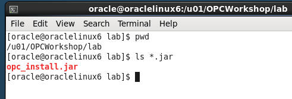

-   The installation command with all of the options is rather lengthy.
    In order to make things easier for you and eliminate potential typos
    the installation command has been saved into a text file named
    **Workshop\_Commands\_URLs.txt**. The file is represented by an icon
    on the Client Image Desktop.

<!-- -->

-   Double click on the Workshop\_Commands\_URLs.txt icon to open up
    the file.

-   Find the “**OPC Cloud Backup Installation**” section in the
    text file.

-   Replace **&lt;opc-identity-domain&gt; &lt;opc-username&gt;** and
    **&lt;opc-passwd&gt;** (including replacing the &lt;&gt;) with the
    **Identity Domain, Username, and Password** student account
    information you were assigned. Also, be sure to put single quotes
    around your password to avoid any issues with special characters.

<!-- -->

-   Before:

-   After

-   **Copy and Paste** the updated command from the text file into your
    terminal and hit Enter.

-   The installation command creates a configuration file
    “**opcorcl.ora**” and wallet directory “**opc\_wallet**” and places
    these in $ORACLE\_HOME/dbs. It also downloads a library file
    “**opclib.so**” that RMAN uses to communicate with the Oracle
    Database Backup Service and places that in $ORACLE\_HOME/lib. You
    specified these locations in the syntax of the install command.

-   Verify the required files have been created by entering the
    following commands

**$ ls $ORACLE\_HOME/lib/libopc\* **

**$ ls $ORACLE\_HOME/dbs/opc\***

#### **Configure RMAN to support Cloud Backups**

Before we can do backups to the Cloud storage location in your account,
you need to configure a number of RMAN properties. These properties
define:

-   How long to retain the backups (30 days)

-   Setting up a device type called “sbt\_tape” that uses the library
    and config files you just installed.

-   Note that any defined storage chunks in the cloud will have names
    starting with “alphacloud\_”

-   Turning on Encryption for data security. This is mandatory for an on
    premise to cloud backup scenario

-   Set a degree of parallelism so that the backup/restore uses
    multiple threads. This is for performance.

-   Setting backup optimization to ON so that RMAN will not
    unnecessarily transfer data to and from the cloud. (e.g. If a backup
    file is already present and has not had any changes before a “new”
    backup is performed, this file will not be dealt with, saving time).

-   Setting a compression level for the files going to/from the cloud

-   Configuring the sbt\_tape device as the default for all backups

<!-- -->

-   Connect RMAN to our local database using **rman target /**

-   Commands in RMAN can be run in blocks so you can do a sequence all
    at once.

<!-- -->

-   **Copy and Paste** from the entire run block in
    **Workshop\_Commands\_URLS.txt** under the **RMAN Config Params**
    section as shown below:

-   Hit Enter and the parameters will be set to the following:

-   Verify the changes in RMAN by typing **show all;**

#### **Backup the On Premise Database**

For backup and recovery we would usually run the following sequence of
commands from a shell script or an RMAN run block, but for lab
illustration purposes we’ll copy and paste each individual command in
sequence so you can get a better feel for what is going on.

-   Under the **RMAN FLOW BACKUP** section of the
    **Workshop\_Commands\_URLS.txt file Copy the first line under the
    word BACKUP and paste it into your RMAN terminal session.**

-   RMAN&gt; set encryption on identified by oracle only;

-   For security reasons, backing up to the Oracle Public Cloud requires
    that encryption is used. The options are Transparent Data
    Encryption (TDE) and/or password encryption. We will be using
    password encryption in this lab.

<!-- -->

-   Copy and Paste the backup command (minus the asterisks)

<!-- -->

-   backup as compressed backupset tag 'onprem' database plus
    archivelog;

<!-- -->

-   The backup will commence. Depending on the speed of your network the
    backup job will take just a few minutes. The database control files
    and SPFILE are the last part to be backed up.

**NOTE:** If for some reason your backup does not finish properly
because of network issues, there is a way to clean up the partial backup
files and retry. This procedure is documented in the **Appendix** at the
end of this lab.

-   When creating a backup, the file chunks are placed in a user defined
    storage container in your account, OR they will be in a system
    generated container called **oracle-data-storage-xxx**. We can
    verify that the backup actually went to the cloud once the backup
    command has completed.

<!-- -->

-   You can use the RMAN list backup summary command to verify the
    backup files. Type the following command into the RMAN
    terminal session.

-   list backup summary;

-   Enter the following command at the RMAN prompt**:**

-   create restore point gold preserve;

#### **Oops…**

-   Now that we have a backup of our database we are going to
    “accidently” drop a table that will reappear once we perform
    the restore.

<!-- -->

-   Open up a new Terminal Window and use SQL\*Plus to connect to the
    **alpha schema** in the local AlphaPDB container database.

$ sqlplus alpha/oracle@alphapdb

-   There is a table called **mstars** in the schema. Query the table to
    view the contents.

$ select \* from mstars;

-   Drop the table with the drop table command

SQL&gt; drop table mstars;

-   Exit SQL\*Plus

<!-- -->

-   SQL&gt; exit;

    1.  #### **Restore and Recover the Database to a Point in Time**

<!-- -->

-   In order to recover from the accidental table drop, we now need to
    restore the database to the point in time before the mstars table
    was accidentally deleted. We’ll use the cloud backup files to
    perform this restore.

<!-- -->

-   Open the RMAN session you used in the previous steps. If you’ve
    exited out of RMAN, it can be started again by entering the
    following within a terminal window:

$ rman target /

Type the following commands to ready the database for a media recovery.

RMAN&gt; shutdown immediate;

RMAN&gt; startup mount;

-   The next few steps will bring the entire database to a point where
    media recovery can occur. This takes the database offline. If you
    had multiple PDBs in the database and only needed to recover data in
    one PDB while leaving the others on-line, you could use the steps
    listed in the **ALTERNATIVE RESTORE** section in
    W**orkshop\_Commands\_URLS.txt under the RMAN FLOW heading. It takes
    a little longer using the ALTERNATIVE RESTORE method, so we’ll use
    the flow under the RESTORE section.**

<!-- -->

-   Set the decryption user name by typing or copying the following
    command from within the RESTORE section of the
    Workshop\_Commands\_URLS.txt file.

RMAN&gt; set decryption identified by oracle;

-   **Copy the run block and Paste it into** the RMAN terminal session.
    The run command will perform the restore / recovery to our “gold”
    restore point. The final step opens the database and resets the logs
    since we’ve restored to a previous point in time.

RMAN&gt; run {

restore to restore point gold database;

recover database to restore point gold;

alter database open resetlogs;

}

-   Press Enter and the commands will be executed:

-   Once the script completes, return to the Terminal Window that was
    used to connect with SQL\*Plus and connect back into the AlphaPDB
    container as alpha/oracle and run a query to see if the mstars table
    has been recovered.

$ sqlplus alpha/oracle@alphapdb

SQL&gt; select \* from mstars;

This concludes lab 3 – Backup and Recovery. Proceed to the next lab when
you’re ready.

**Appendix**

-   In case your backup does not complete properly you can clean up the
    partial backupset and rerun the backup. You may have to wait a few
    minutes after the backup failure before the partial backup files can
    be deleted.

<!-- -->

-   Start up RMAN and type:

<!-- -->

-   RMAN&gt; delete noprompt backupset tag ‘onprem’;

<!-- -->

-   Rerun the backup

<!-- -->

-   RMAN&gt; backup as compressed backupset tag 'onprem' database plus
    archivelog;

4.  Database Development
    ====================

    4.  ### Introduction

In this lab you will deploy an APEX application to the Alpha Clone PDB
and adjust the firewall rules to support access to the application from
the Internet using a PC based browser or mobile device.

### Objectives

-   Enable APEX in the Alpha Clone PDB.

-   Create APEX REST services

-   Deploy and access an Alpha Office APEX application.

    1.  ### Lab Requirements

-   The following lab assume that the steps outlined in lab guides 100
    and 200 have been completed.

-   VNC Viewer for access to the cloud client image

-   The SSH tunnels must be active in a terminal window.

    1.  ### Alpha Office and APEX

        1.  #### **APEX Workspace Administration**

The Alpha Clone database contains an unused APEX configuration. As the
first part of this lab we will complete the configuration of the cloned
database APEX configuration.

**Note:** The standard install of APEX for a 12c database created many
objects shared by both the container and pluggable database but user and
password information is always local to the database we access. In other
words, the APEX password we set in Lab 100 has not been in the cloned
database.

-   Make sure the SSH tunnels you set up in lab 100 are still active in
    your terminal window, if not refer to lab 100 to set up the
    SSH tunnels.

<!-- -->

-   During the plug-in operation, many of the common objects in the
    pluggable database were evaluated by the database and some changes
    were made to the new database to work with its new container. One of
    these adjustments was locking the database accounts used to provide
    REST services. We will need to unlock the APEX\_LISTENER and
    APEX\_REST\_PUBLIC\_USER accounts.

<!-- -->

-   If it’s not already running, startup SQL Developer from the Cloud
    Client desktop on the VNC connection.

-   Open the DBA Window and locate the **Alpha Clone - DBCS** item
    (created in Lab 200) in the **DBA Navigator**

-   Expand it and click on the **SecurityUsers** item.

-   Right-mouse on **APEX\_LISTENER** and select **Unlock User…**

-   Click the **Apply** button to unlock APEX\_LISTENER. You may also
    use the SQL tab to review the unlock statement.

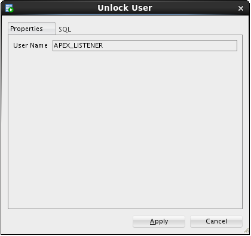

-   Repeat the **Unlock User…** operation for the
    **APEX\_REST\_PUBLIC\_USER**.

#### **Create the Alpha Office workspace **

-   In the **Chrome** browser, open up a new tab and test the updated
    rule by accessing the APEX instance in the container database from
    the Internet. Use the Public IP address from the cloud instance we
    created in the first lab.

**Note:** Be sure to use the https protocol.

**https://&lt;your-Public-IP&gt;/apex/alphaclone/apex\_admin**

-   After you’ve accepted the SSL certificate and see the APEX
    administration page, enter the following admin credentials and click
    the **Login to Administration** button:

| **Username:** | admin       |
|---------------|-------------|
| **Password:** | Alpha2014\_ |

-   You ***may*** be prompted to change the ADMIN user password, if not,
    skip to the next step. These credentials apply to the APEX objects
    local to the pluggable database. For convenience, we will enter the
    same password as the container database.

-   Enter the following values and click the **Apply Changes** button.

| **Enter Current Password:** | Alpha2014\_ |
|-----------------------------|-------------|
| **Enter New Password:**     | Alpha2015!  |
| **Confirm New Password: **  | Alpha2015!  |

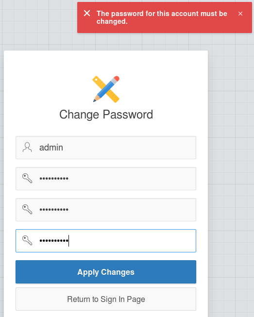

-   After logging in successfully, feel free to click around in the APEX
    interface to get familiar with it.

-   When you’re ready to begin, click the **Create Workspace** button

-   At the **Identify Workspace** dialog, enter the following workspace
    name and click the **Next** button.

| **Workspace Name:** | AlphaDev |
|---------------------|----------|

-   At the **Identify Schema** dialog, select and enter the following
    values followed by the **Next** button.  
      
    **Note:** Use the search icon
     to find the
    ALPHA schema.

| **Re-use existing schema?** | Yes   |
|-----------------------------|-------|
| **Schema Name:**            | ALPHA |

At the **Identify Administrator** dialog, enter the following values and
click the **Next** button.

| **Administrator Username:** | ADMIN                                   |
|-----------------------------|-----------------------------------------|
| **Administrator Password:** | Alpha2014\_ (May be prompted to change) |
| **Email:**                  | dummy@localhost.localdomain             |

-   Review the selections on the Confirm Request page and then click the
    **Create Workspace** button.

-   APEX will display the ‘Workspace Created’ message

-   Click **Done**

-   Click the ADMIN dropdown in the upper right and select **Signout**

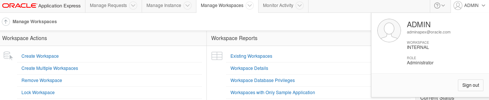

-   Click the Return to **‘Sign In Page’** to continue

#### **Build REST services**

-   Login to the Alpha Office APEX development workspace using the
    following credentials.

| **Workspace:** | AlphaDev    |
|----------------|-------------|
| **Username:**  | ADMIN       |
| **Password:**  | Alpha2014\_ |

-   You ***may*** be prompted to change your password. Enter the
    following values and click the **Apply Changes** button.

| **Enter Current Password** | Alpha2014\_ |
|----------------------------|-------------|
| **Enter New Password**     | Alpah2015!  |
| **Confirm New Password **  | Alpha2015!  |

-   Once you’ve logged in successfully, click the **SQL
    Workshop** button.

-   Click the **RESTful Services** button.

-   Click the **Create &gt;** button

-   There are three sections on the RESTful Services page:

<!-- -->

-   Restful Services Module

-   Resource Template

-   Resource Handler

-   Fill out the information for these sections using the information
    provided below.

<!-- -->

-   For the **RESTful Services Module** section, use the following
    values:

| **Name:**       | alpha.office |
|-----------------|--------------|
| **URI Prefix:** | alphaofc/    |

-   In the **Resource Template** section enter the following value:

| **URI Template** | products/ |
|------------------|-----------|

-   For the last section titled **Resource Handler** use the following
    values:

| **Method:**      | GET                     |
|------------------|-------------------------|
| **Source Type:** | Query                   |
| **Format:**      | JSON                    |
| **Source:**      | select \* from products |

-   Click **Create Module** to complete the REST service creation.

-   APEX will show the new service module with a confirmation message.

<!-- -->

-   Click the **GET** handler for our template in the folder structure
    on the left of the screen.

-   Review the definition.

-   Since this operation has no parameters, we can easily test it by
    clicking the **Test** button.

-   Review the JSON produced by the service.

-   Click the browser's **back button** to return to the APEX page.

#### **Create a Parameterized REST Service**

-   In the next section we will create a REST service that takes a
    product number and returns only one database row as a JSON object.

<!-- -->

-   Click the **Create Template** link.

-   Enter the following URI Template.

**Note:** The **{id}** syntax indicates the REST call accepts one
parameter named "id" - this is automatically available in later for SQL
queries.

-   When the entry is complete, click the **Create** button.

| **URI Template:** | product/{id} |
|-------------------|--------------|

-   APEX displays a success message for the new template

-   Click the **Create Handler** link under the **product/{id}**
    template on the left side of the screen.

-   Enter the following SQL statement in the Source field of the
    Resource Handler page. Notice the use of the ":id" bind variable,
    this value comes from the URI template {id} provided when the
    service is invoked.

**Source:**

select \*

from products

where product\_id = :id

-   Once you’ve finished entering the SQL statement, click the
    **Create** button.

-   Notice the ‘Action Processed’ at the top of your screen. We will
    test this service just like before, but we need to provide a product
    number to the call.

<!-- -->

-   **Scroll** to the bottom of the page and in the Test section, click
    the **Set Bind Variables** button.

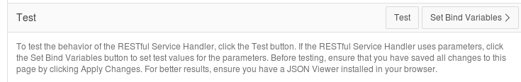

-   Enter the following product number and click the **Test** button.

| **:ID** | 1020 |
|---------|------|

-   In the new browser window, notice only the single product shows in
    the JSON object.

<!-- -->

-   **Close** this pop-up window.

> 

#### **Install APEX Mobile Application**

-   Click the **Application Builder** menu item on the APEX page.

-   Click the **Import** button on the Application Builder page.

-   Click the **Browse** button to locate the APEX application
    export file.

-   Locate and open the following file and click the Open button:

**/u01/OPCWorkshop/lab/f101.sql**

-   Click the **Next** button to continue.

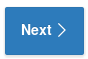

-   After a brief pause while the application file is processed, click
    the **Next** button to continue.

-   On the final page, select to **Reuse Application ID 101 from Export
    File**

-   Click **Install Application**.
    

<!-- -->

-   APEX displays a success message for the import

-   Click **Run** **Application**.

-   APEX renders the first page of the mobile application in the browser
    – it might not look quite right since we are using a
    mobile template.

#### **Access the Alpha Office Mobile Application on your Smart Device**

-   Using any Internet connected smart phone or tablet we will access
    the mobile application using the port we opened earlier in the lab.
    This example is using an Apple iPhone 5s.

<!-- -->

-   Use your device's browser and navigate to the following URL:

**https://&lt; Public IP Address of
Alpha01A-DBCS&gt;/apex/alphaclone/f?p=101**

-   The browser should prompt you to accept the unknown certificate.

-   Click of touch **Continue**.

-   Touch the screen to explore the application. On the device, touching
    one of the pie slices highlights the slice; a second tap drills into
    that slice.

-   Congratulations, you’ve created an application on the Oracle
    Database Cloud. This is the final lab for the DBCS Workshop.

