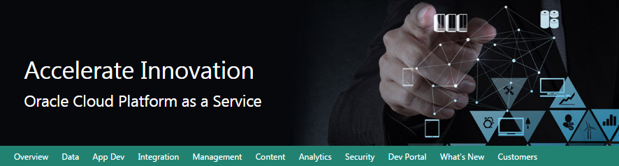

Oracle Data Management Cloud Workshop

Database Cloud Service

Updated: XXX 0, 0000

**Safe Harbor Statement**

The following is intended to outline our general product direction. It
is intended for information purposes only, and may not be incorporated
into any contract. It is not a commitment to deliver any material, code,
or functionality, and should not be relied upon in making purchasing
decisions.

The development, release, and timing of any features or functionality
described for Oracle’s products remains at the sole discretion of
Oracle.

**Oracle Training Materials – Usage Agreement**

Use of this Site (“Site”) or Materials constitutes agreement with the
following terms and conditions:

1. Oracle Corporation (“Oracle”) is pleased to allow its business
partner (“Partner”) to download and copy the information, documents, and
the online training courses (collectively, “Materials") found on this
Site. The use of the Materials is restricted to the non-commercial,
internal training of the Partner’s employees only. The Materials may not
be used for training, promotion, or sales to customers or other partners
or third parties.

2. All the Materials are trademarks of Oracle and are proprietary
information of Oracle. Partner or other third party at no time has any
right to resell, redistribute or create derivative works from the
Materials.

3. Oracle disclaims any warranties or representations as to the accuracy
or completeness of any Materials.  Materials are provided "as is"
without warranty of any kind, either express or implied, including
without limitation warranties of merchantability, fitness for a
particular purpose, and non-infringement.

4. Under no circumstances shall Oracle or the Oracle Authorized Delivery
Partner be liable for any loss, damage, liability or expense incurred or
suffered which is claimed to have resulted from use of this Site of
Materials. As a condition of use of the Materials, Partner agrees to
indemnify Oracle from and against any and all actions, claims, losses,
damages, liabilities and expenses (including reasonable attorneys' fees)
arising out of Partner’s use of the Materials.

5. Reference materials including but not limited to those identified in
the Boot Camp manifest cannot be redistributed in any format without
Oracle written consent.

## Contents

- Oracle Page
- [Section 1: Database Cloud Service Overview](#1.-Section-1:-Database-Cloud-Service-Overview)
   - 1.1: Introduction
   - 1.2: Objectives
   - 1.3: Lab Requirements
   - 1.4: Retrieve Public IP for Client Image
   - 1.5: Create Database Cloud Service Instance
   - 1.6: Configuration and Image Exploration
- [Section 2: Cloud Migration](#Section-2:-Cloud-Migration)
   - 2.1: Introduction
   - 2.2: Objectives
   - 2.3: System Requirements
   - 2.4: Cloud Migration Using Pluggable Databases
   - 2.5: Cloud Migration Using Data Pump
   - 2.6: Cloud Migration Using SQL Developer Carts
- [Section 3: Backup and Recovery](#Section-3:-Backup-and-Recovery)
   - 3.1: Introduction
   - 3.2: Objectives
   - 3.3: Lab Requirements
   - 3.4: Oracle Public Cloud Backup Recovery
- [Section 4: Database Development](#Section-4:-Database-Development)
   - 4.1: Introduction
   - 4.2: Objectives
   - 4.3: Lab Requirements
   - 4.4: Alpha Office and APEX
 

1.  Section 1: Database Cloud Service Overview 
    ================================

    1.  ### Introduction

This lab will help give you
a basic understanding of the Oracle Database Cloud Service and it’s
capabilities around administration and database development.

We will walk through creating a new Database Cloud Service instance.
After the database has been created, you will connect into the Database
image using an SSH private key and familiarize yourself with the image
layout. Next you will learn about SSH tunneling using an SSH
configuration file. This file will be used to tunnel multiple ports to a
remote OPC instance. Using the tunnels, you will learn how to access
various Database consoles.

### Objectives

-   Create Database Cloud Service

-   Configure security with SSH

-   Explore VM and cloud consoles

    1.  ### Lab Requirements

<!-- -->

-   VNC Viewer to connect to an Image running on Oracle’s IaaS
    Compute Service.

-   Laptop capable of connecting to the internet and running VNC Viewer

-   Cloud environment access details provided by instructor in advance
    of the class

**Note:** *Use the table below and fill in the blanks as you go through
the labs. Create a text file or note on your VNC desktop to keep track
of important information you’ll need throughout the lab exercises so
that you can easily copy and paste the information.*

| Cloud Data Center:                      |     |
|-----------------------------------------|-----|
| Identity Domain:                        |     |
| Login Username (s):                     |     |
| Login Password:                         |     |
| Alpha01A-DBCS Cloud Public IP Address:  |     |
| Alpha01A-DBCS Cloud Private IP Address: |     |
| Site Location ID:                       |     |
| Alpha01B-DBCS Cloud Public IP Address:  |     |
| Alpha01B-DBCS Cloud Private IP Address: |     |
| Client Public IP Address:               |     |
| Client Private IP Address:              |     |
| VNC Viewer Port \#:                     |     |
| Client Image VNC Viewer Password:       |     |

### Retrieve Public IP for Client Image

For the Database Cloud Service Workshop we will be using a Client Image
running in the Oracle Compute cloud to simulate the on premise
environment. This client image is running Linux and contains a
preinstalled Oracle 12.1.0.2 database with a pluggable database that we
will migrate to the Oracle Public Cloud Database instance. The client
image contains SQL Developer 4.1, SQL\*Plus and other utilities that
will be used to connect and manipulate both the local and cloud database
instances.

The Client Image is a VM that is running on Oracle’s IaaS Compute
service.

#### **Retrieve Public IP for Client Image**

-   Login to your Oracle Cloud account

-   Open a browser and go to the following URL: https://cloud.oracle.com

-   Click **Sign In** in the upper right hand corner of the browser

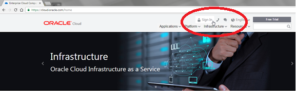

-   Under My Services &gt; Select Data Center … select the region from
    the drop down list. Your instructor will provide this information to
    you prior the course.
    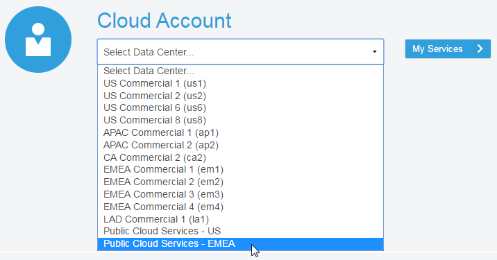

<!-- -->

-   Enter the **identity domain** and click **Go**

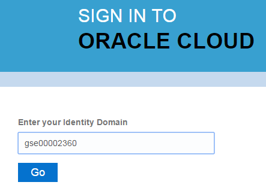

-   After entering the Identity Domain you will enter the User Name and
    Password

-   Click **Sign In**

**NOTE**: The **Identity Domain, User Name** and **Password** values
were provided to you by your instructor prior to starting this lab.

-   You should see the Dashboard summarizing all of your
    available services. Compute, backup, and storage are all related to
    the Database Cloud Service.

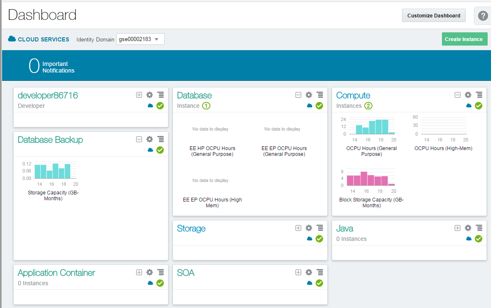

-   If there’s a service that’s not visible, **click** on the
    **Customize Dashboard dropdown** and add each service as a
    **favorite** by clicking on the **Show button** next to the service.

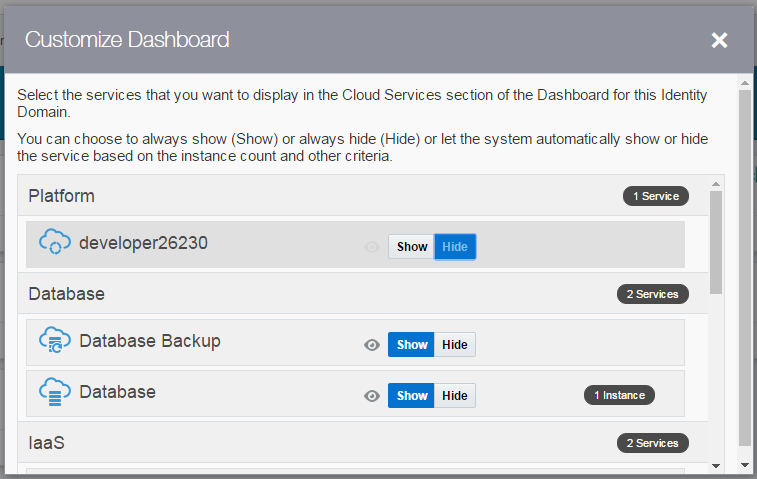

-   From the main dashboard, click on the **Compute** service link to
    access the Compute Service Console. This is where we will get the IP
    address of our database service.

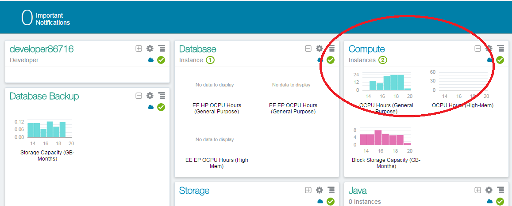

-   From this page you can view general information about this Compute
    Cloud Service. Click on the **Open Service Console** button.

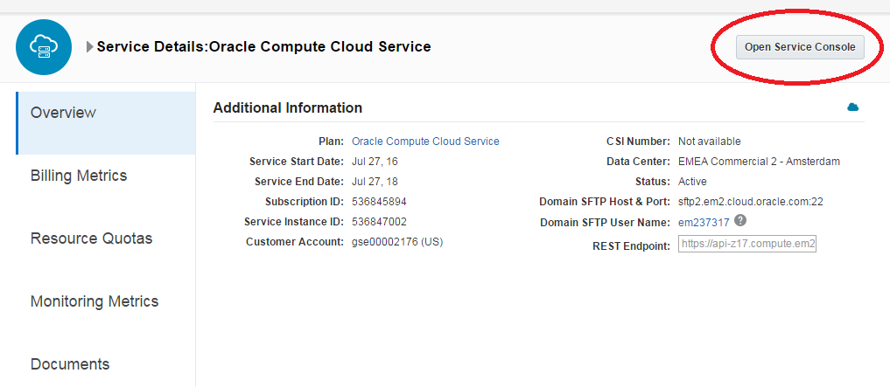

-   The Compute Service Console will give you a summary of the resources
    your cloud service is using and a list all running VM’s.

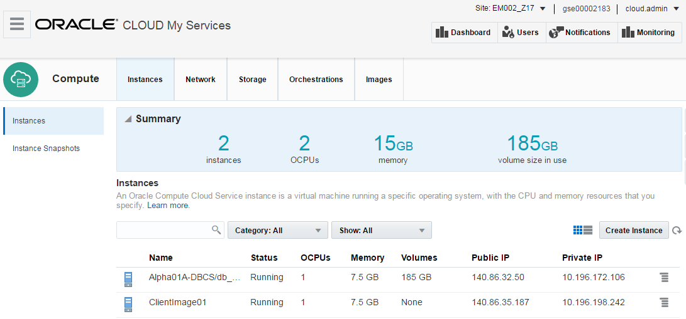

-   Identity Domains have multiple sites. If you don’t see your VM
    images in the Compute Console, you may be in the wrong site.

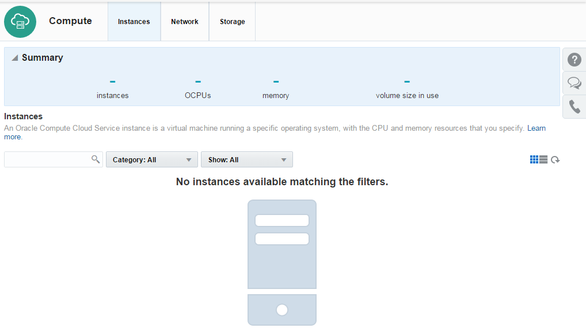

-   Please ask your instructor which site the Client Image is
    running on. If necessary, click the **Site** dropdown at the top of
    the page to access the **Site Selector** and choose the
    correct site.

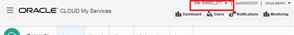

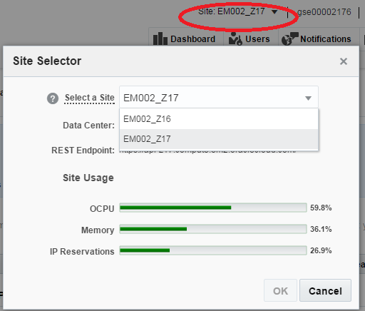

-   Once the correct site has been selected, locate the instance named
    **ClientImage01** and copy the **Public IP. **

-   **Note: Keep this IP Address somewhere accessible, like a notepad or
    text document. We will use this IP with VNC to connect to the cloud
    client desktop.**

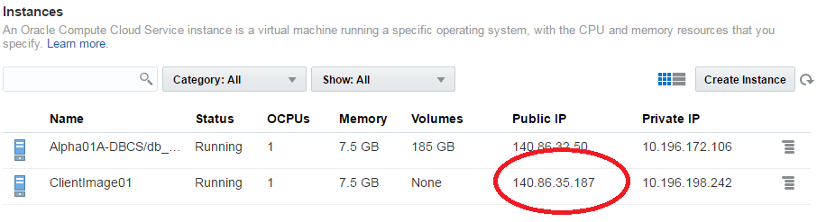

#### **Connect to Client Image using VNC Viewer**

-   From your desktop run the VNC Viewer application and enter the
    Public IP address you just obtained, with a display port **separated
    from the IP address by a colon &lt;:443&gt;** and click **Connect**

***Note 1:** If connecting inside an Oracle office through the
‘clear-guest’ network, and the VNC session won’t connect or times out,
try port :10.*

**Note 2:** If you do not already have a VNC Viewer installed on your
computer you will need to download it. Or ask the instructor for the
Real VNC Viewer executable.

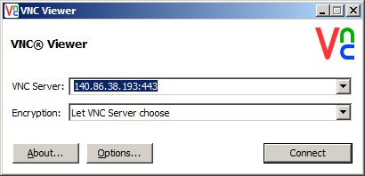

-   Click Continue on the encryption message.

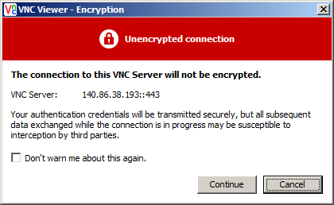

-   Enter the password supplied by your instructor and click **OK**

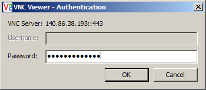

-   Verify that you can see and interact with the Linux desktop. You are
    now connected to the Client Image that will be used for all labs.

> 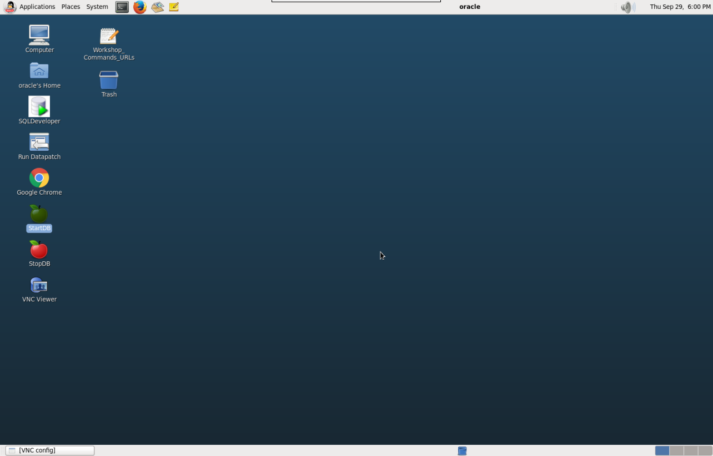

1.  ### Create Database Cloud Service Instance

    1.  #### **Login to your Oracle Cloud account**

-   From within the VNC Session open the **Google Chrome browser**
     and go to
    the following URL:
    [**https://cloud.oracle.com**](https://cloud.oracle.com)

<!-- -->

-   Click **Sign In** in the upper right hand corner of the browser

<!-- -->

-   Under the Cloud Account field click on the Select Data Center drop
    down, choose the data center location (for demos and trials, it’s
    usually EMEA) then click on the My Services &gt; button.

**IMPORTANT** - Under My Services, the **Data Center location** is
provided to you in the *lab connection instructions*.

-   In the next screen enter the **identity domain** and click **GO**

-   Enter the cloud User Name and Password and click **Sign In**

**NOTE**: The **Identity Domain, User Name** and **Password** values are
provided in the *lab connection instructions*.

-   You should see the Dashboard summarizing all of the
    available services.

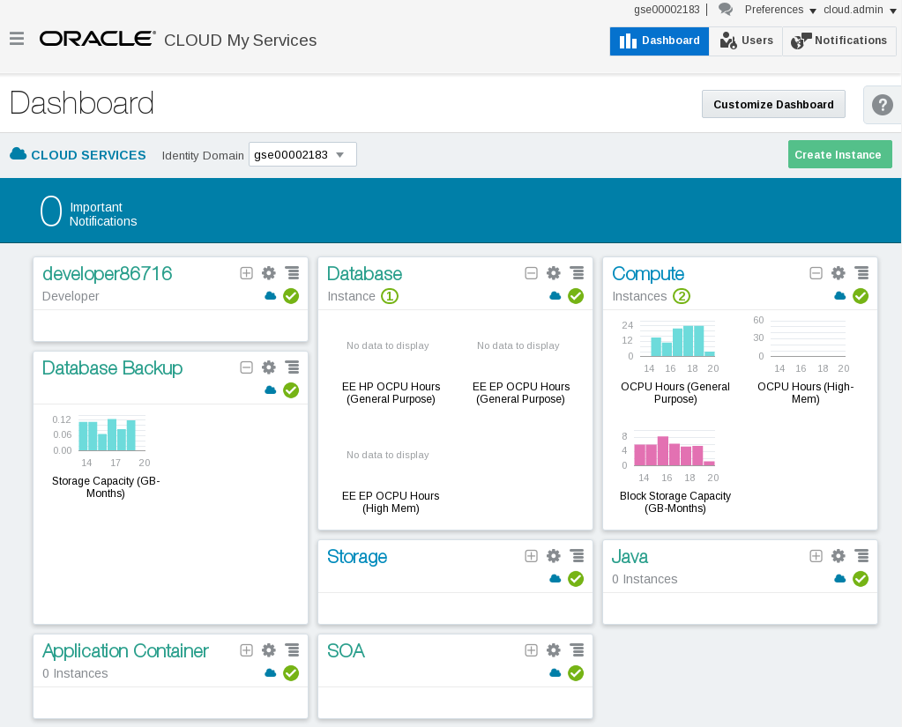

#### **Create Database Cloud Service**

-   From the main dashboard, click on the ***Database*** service link

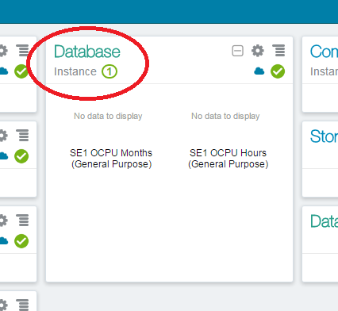

-   From this page you can view general information about this Database
    Cloud Service. Click on the **Open Service Console** button.
    ---**Stop here**

-   From the console, click the **Create Service button**

-   ***Note:** There should already be a service
    provisioned (Alpha01A-DBCS). It was created earlier in order to save
    lab time. This service will be utilized later in the lab, don’t
    interact with it at this point.*

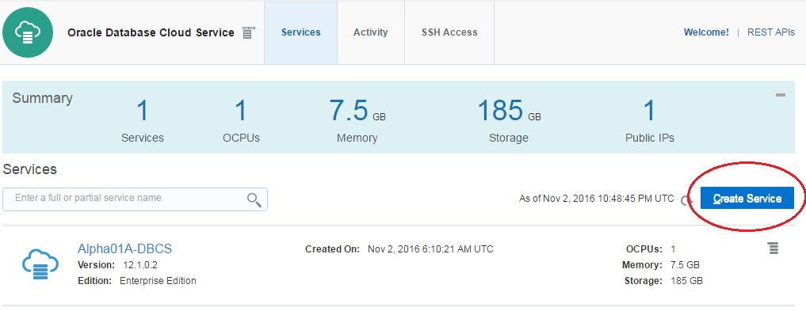

 Important Step!
In the next steps, you will provide identity service configuration
details and select the compute shape for your new Database instance.

**Note:** Service Name must be unique. When providing a name, please
note you may have another service instance already created in your
account.

-   Use the information from the following table for the Service
    Configuration details:

| **Basic Service Information** |
|-------------------------------|
| **Service Name**              |
| **Description**               |
| **Service Level**             |
| **Metering Frequency**        |
| **Software Release**          |
| **Software Edition**          |
| **Database Type**             |

*Below are examples of the alternate selections for each*

-   Your screen should look like this …

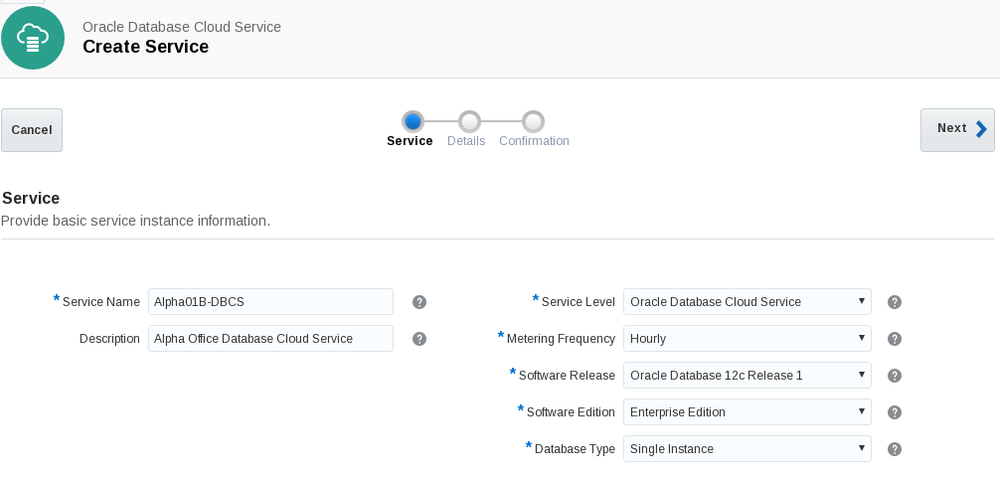

-   Click **Next** to continue

<!-- -->

-   In the next screen we will fill out the **Service Details** for our
    Database Cloud instance. The screen will be broken down into
    sections to make the information easier to understand.

<!-- -->

-   Here is an example of the completed Service Details Screen. Continue
    to the next step for details on how to fill this form in correctly.

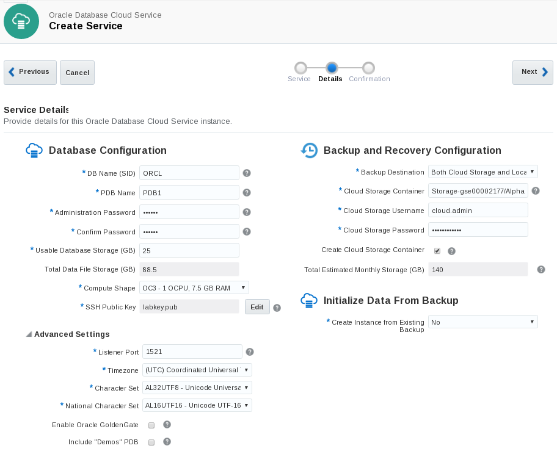

Section 1: Database Configuration:

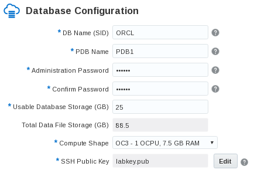

| **Section 1: Database Configuration ** |
|----------------------------------------|
| **DB Name (SID)**                      |
| **PDB Name**                           |
| **Administration Password**            |
| **Usable Database Storage (GB)**       |
| **Total Data File Storage (GB)**       |
| **Compute Shape**                      |
| **SSH Public Key**                     |

**Note: The SSH Key has already been created for you. It’s named
labkey.pub and can be found on the client image under
/u01/OPCWorkshop/lab/ **

-   On the SSH Public Key section, click Edit

-   **Click on the Edit button to browse for the labkey.pub **

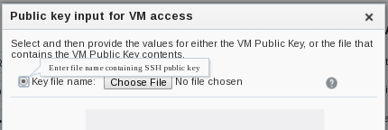

-   **Make sure the Key File name: radio button is checked and click
    Choose File**

-   **Navigate to the following subdirectory on your system:
    /u01/OPCWorkshop/lab/**

-   **Choose the file named labkey.pub**

