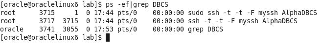
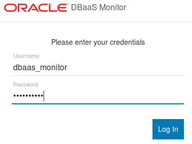
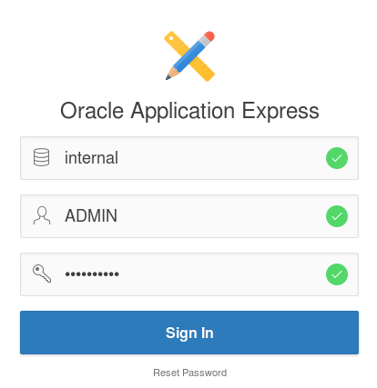
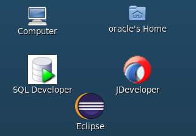
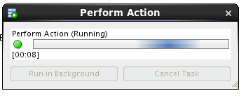
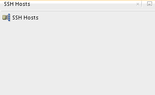
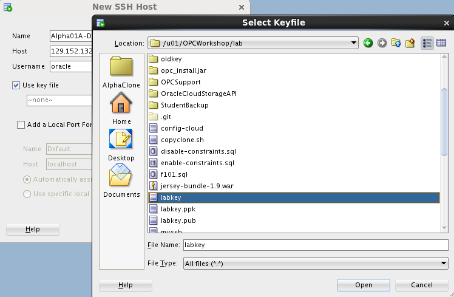

-   Click Open and confirm that labkey.pub is shown on the screen

-   Click **Enter** and continue filling out the Details form. Continue
    on to the **Backup and Recovery** and **Initialize Data From Backup
    Configuration** Sections

-   Use the information from the following table to help fill out the
    **Backup and Recovery Configuration** and **Initialize Data From
    Backup** sections.

| **Backup and Recovery Configuration Information ** |
|----------------------------------------------------|
| **Backup Destination**                             |
| **Cloud Storage Container**                        |
| **Cloud Storage Username**                         |
| **Cloud Storage Password**                         |
| **Create Cloud Storage Container**                 |
| **Total Estimated Monthly Storage (GB)**           |
| **Create Instance from Existing Backup**           |

**Note**: By checking the box labeled - **Create Cloud Storage
Container**, if the container does not exist it will be created
automatically. This will be the location for all backups

-   Confirm the following information from the **Advanced
    Settings** section. This information is default and doesn’t need to
    be altered.

-   After all fields have been filled out , click on **Next**

-   Review the Confirmation screen and confirm that your entries
    are correct. When you’re satisfied that everything is in order click
    **Create. **

-   You should be returned to the dashboard and your new Database Cloud
    Service instance **Alpha01B-DBCS should be visible and labeled as
    ‘In Progress’**

-   The creation of the DBCS instance will take approximately
    20 minutes. While your DBCS instance is being created, you can view
    the current status clicking on the **In Progress** link.

**NOTE**: To save time we will continue with the lab by utilizing
**Alpha01A-DBCS** DBCS instance already created. Alpha01A-DBCS was
created following the exact steps you just performed.

1.  ### Configuration and Image Exploration

    1.  #### **Record the IP address of the Database Cloud Service**

In the following steps you will record the IP addresses of the Virtual
Machine on which the cloud service runs and configure SSH connectivity
to **Alpha01A-DBCS**. Then you will access the different monitoring,
configuration, and development consoles available on Oracle Database
Cloud Service.

-   Click on **Alpha01A-DBCS** link or cloud icon from the list of
    Database Instances to get further details on Alpha01A-DBCS

-   Note the Public IP address of **Alpha01A-DBCS**. In the below
    example the address is 140.86.12.71, yours will be different.

#### **Create the SSH configuration file and start tunnels**

For obvious reasons the default Oracle Public Cloud network
configuration is very secure. Customers can open individual ports to the
various servers in the cloud environment through the Compute Cloud
Service Console or they can create SSH tunnels to the specific
server/port combinations as needed.

In this section we will use **SSH Tunnels** to communicate securely
between the client and the Cloud Database instance. We have built a
**script that automatically creates these tunnels for you.** You will
review the script later in the exercise so you can learn how to create
them on your own.

We will show you how to use secure tunnels as well as how to open ports
for the following exercises.

In step 1.6.2 you will run the script that creates and configures an SSH
file that will be used to connect to your various servers. Once the SSH
file is created, it is used as a script to create the SSH tunnels in the
background with connections to selected ports used in this and other
labs.

-   Open a terminal Window using the Utilities menu or by clicking the
    terminal icon.
    

<!-- -->

-   Change into the lab directory **cd lab**

-   Run the SSH script to open the ports. Type **./setssh.sh DBONLY** in
    the terminal window

-   **If you make an error you’ll see:**

-   Enter the Cloud Database IP address obtained in Step 1.6.1 and.
    Click **OK**.

The script will try a test connection to your server. If successful, an
SSH configuration file is created and an SSH session to the DB server
will be started in the background.

If the script encounters any problems, or you entered the wrong address,
you will be re-prompted to enter the IP address.

If the tunnels are created successfully you will see a Success
Information Dialog.

-   Click OK on the dialog box to clear it.

**Note:** Do not close the terminal window that you used to run the SSH
Configuration script. Closing the terminal window will shut down the
background SSH tunnel processes. If you accidentally shut the terminal
window, you can start over again at step 1.6.2 and run the script again.
You might want to minimize this terminal window until you need to stop
the tunnels.

-   Examine the script to view and understand the commands used to start
    the tunnels.

<!-- -->

-   Type **gedit** myssh in the terminal window

Notice under the **Host AlphaDBCS** section of the configuration file
that the DBCS IP address has been inserted in 5 areas defining
LocalForward ports (1526, 443, 4848, and 5500). Which correspond to host
direct access, MySQL, APEX, DB Monitor, Glassfish, and Enterprise
Manager. These ports can now be accessed locally using “localhost” in
connection information or URLs.

**Tunneling Script Example:**

-   Close the edit session.

-   Type **ps -ef | grep DBCS** to see the background session created.

#### **Explore DB image via SSH**

In the previous step, you started SSH tunnels in the background for
access to development tools and the browser. In this step we will
demonstrate how to do an explicit SSH connection to your DB cloud
server.

-   Enter the below command in the same terminal window you ran the
    setssh.sh script, using the Public IP address of your DBCS
    cloud instance.

-   $ ssh -o StrictHostKeyChecking=no -i ./labkey
    oracle@&lt;**your-DB-Public-IP**&gt;

After successfully connecting to Alpha01A-DBCS you can browse the image.

-   Issue a **df** command to see mounted disks and existing space.

-   $ df -h

-   View the Database environment variables.

<!-- -->

-   $ **env | grep ORA**

-   Change directories to the Oracle Home and list the directories.

-   $ **cd $ORACLE\_HOME**

-   $ **ls**

Type **exit** once to close the session.

$ exit

**NOTE:** By typing exit once, you are exiting the Cloud DBCS Service
SSH session. If you are running commands in the same window you started
the SSH tunnel scrip in and you type exit twice you will exit the
terminal window and you will terminate the SSH tunnels. Do not exit the
Terminal window, these SSH Tunnels will be used during the remainder of
the lab. Feel free to minimize the SSH Tunnel terminal and start a new
one to avoid accidentally closing the tunnels.

#### **Access the Compute Cloud Service and open SSH ports for access.**

**NOTE:** For any of the URLs mentioned in this section you can also use
the predefined browser links. If blocked ports on the network cause an
issue loading any of these consoles, the predefined browser links will
help by routing the traffic through the SSH tunnel that should already
be open:

To gain access to the various consoles used by the Database Cloud
Service you have two options. You can open up the port on which the
monitor is listening, or you can create an SSH tunnel to the specific
server/port combinations as needed. We have already created the SSH
tunnels and those will be used to access the consoles we need for this
lab.

In this step you will open the port 443 on the VM using a pre-created
access rule and protocol definition.

-   Return to your Cloud.oracle.com session on the Google browser. If
    you’ve logged out for any reason, log back into the cloud account
    using the details at the start of the lab.

-   Click the header menu in the upper left next to Oracle Cloud My
    Services and choose the Compute Cloud console

-   Click on **Compute Cloud Service Console** menu item

-   Verify that you’re on the correct site and that the Alpha01A-DBCS
    and Alpha01B-DBCS instance are visible.

-   From the top menu bar click on **Network** tab.

The Network section will allow you to manage security access, IP
networking, and SSH information. There can be many entries so we’ll
filter out what we’re looking for.

-   With the Security &gt; Security Rules section selected, type
    **httpssl** into the search box and hit enter or click the
    magnifying glass icon.

**Note:** If you can’t see the particular rule clearly, widen your
browser screen or click on the table icon to change the view.

-   For each instance there is an httpssl rule called
    ‘**ora\_p2\_httpssl’. **

-   **To change the rule for the Alpha01A-DBCS** instance click on the
    **hamburger menu**
     or on the
    colored arrows and select **Update**

-   Change Status to **Enabled** and click **Update**

-   Notice the status change for the **ora\_p2\_httpssl** Access rule to
    **Enabled**. The port is now open and can be accessed without the
    tunnels if necessary.

-   Navigate back to the **Database Cloud Service Console** by clicking
    the header icon and selecting **Database Cloud Service**.

-   For the **Alpha01A-DBCS** instance click the **hamburger menu**
     and select
    **Open DBaaS Monitor Console.**

-   You will likely get a security warning, click **ADVANCED** followed
    by **Proceed to &lt;your IP Address&gt; (unsafe)**

-   Login to the DBaaS monitor

| **User Name:** | dbaas\_monitor |
|----------------|----------------|
| **Password:**  | Alpha2014\_    |

-   Once connected to the Database Monitor Console, feel free to explore
    the various screens. Click on the header items to familiarize
    yourself with DBaaS monitor.

-   Logout when finished

#### **Access Enterprise Manager DB Express**

-   On the browser, open a new tab and **enter** the following **URL**
    to access the **EM Express** page. The first time the URL is used,
    it can take a minute for the console to load.

**Note**: The setssh.sh script that you ran earlier in this lab created
the ssh tunnel which routes all traffic over localhost:5500 to the
database cloud service.

-   **https://localhost:5500/em**

-   If you get a security warning, click **ADVANCED** followed by
    **Proceed to localhost (unsafe)**

-   On the EM login page enter the following and click on **Login**:

| **User Name:** | sys         |
|----------------|-------------|
| **Password:**  | Alpha2014\_ |
| **Checkbox:**  | “as sysdba” |

-   Click on different items on the Enterprise Manager console to get
    familiar with its capabilities.

-   Logout when finished.

#### **Access Apex Monitor**

-   Enter the following URL into a browser window to access the **Apex
    console** (click to add a security exception if necessary).

**Note**: All traffic to the default https port (443) on local host is
also routed through the SSH tunnel to the database cloud service.

-   **https://localhost/apex/pdb1/**

-   If you get a security warning, click **ADVANCED** followed by
    **Proceed to localhost (unsafe)**

-   Once the Apex login window is displayed, **enter the following** and
    click on **Sign In**:

| **Workspace:** | internal    |
|----------------|-------------|
| **Username:**  | ADMIN       |
| **Password:**  | Alpha2014\_ |

-   You are now connected to Apex. Feel free to explore the various
    menu options. The last lab in this workshop will walk you through
    the creation of a simple application.

-   Log out of APEX when you are finished.

-   This concludes the first lab, Overview of DBCS. Proceed to the next
    lab when ready.

1.  Cloud Migration
    ===============

    1.  ### Introduction

In this lab you will explore some common methods for moving data from on
premise to the cloud. There are multiple options for solving this data
movement challenge. In this lab we will use SQL\*Developer and command
line tools to clone and move a pluggable database from an on premise
database (in the provided Virtual Machine) to a cloud database. We will
also use standard Oracle Data Pump tools to export a schema from the on
premise database, and then import that data to a cloud database in a new
schema. The final exercise will use the SQL Developer cart feature to
quickly move data from the local database to the cloud using only the
privileges of a normal schema owner.

### Objectives

-   Clone, unplug, transfer, and plug the AlphaPDB pluggable database
    using SQL Developer.

-   Export and import a schema using SQL Developer to execute Oracle
    Data Pump jobs.

-   Export and import a small collection of tables using SQL Developer.

    1.  ### System Requirements

<!-- -->

-   VNC Viewer for connection to client system

-   Successful completion of Section 1: Database Cloud Service
    Overview lab.

-   The SSH tunnels must be active in a terminal window in the client
    system

    1.  ### Cloud Migration Using Pluggable Databases

In this section of the lab we will prepare the on premise environment
and create connections. Then we’ll clone the database. We’ll create SSH
connections to the cloud instance and finally we’ll copy the clone to
the public cloud using Oracle SQL Developer. Once the database has been
cloned we will patch the instance to bring it up to date with the Cloud
Container database. We will verify successful patching and login in to
the newly migrated Database instance.

#### **Configure the Environment**

-   From the VNC Session desktop, locate and double-click on the
    **StartDB** icon**.** It will take a minute for the Database to
    fully start. Once started, the Terminal Log Window will
    automatically close.

-   From the VNC Session desktop, locate and double-click on the **SQL
    Developer** icon. We will use SQL Developer to connect to the on
    premise database.

**NOTE:** The first time SQL Developer is brought up, it may a few
minutes to start up.

-   Double-click the **On-premise** folder or click on the plus sign
    next the folder to expand the list of database connections. Please
    note the pre-configured connections to the on-premise database,
    Alpha – PDB, sys- AlphaPDB and sys-CDB.

-   Select the **View** -&gt; **DBA** menu option from the top dropdown
    menu to open up the DBA navigator panel.

-   On the DBA panel, click the green plus icon to create a
    new connection.

**Note**: you can also right-click on the green plus sign under
Connections and select Add Connection.

-   Select the **sys - CDB** connection and click **OK**.

**Note:** “sys – CDB” is the on premise database located on the virtual
client Image.

-   Expand the **sys - CDB connection by double clicking or by clicking
    on the plus sign,** then expand the **Container Database**
    tree item. Click on the **ALPHAPDB** pluggable database item and
    view the details for the pluggable database.

#### **Clone the ALPHAPDB**

-   In the DBA Navigator
    panel, right click on the ALPHAPDB pluggable database and select the
    **Clone Pluggable Database…** menu option.

-   Enter the following: Database Name: **ALPHACLONE**

-   Select **Custom Names** from the File Name Conversions section and
    review the Source File names. Note the name "**/AlphaPDB/**" for the
    directory of the source file names. For a successful cloning
    operation, we must create new target files that are different than
    the source files.

**Note**: At this point we could manually change all the target files to
point to a different directory, but following are directions for an
easier way to do this.

-   Select **Custom Expressions** from the File Name Conversions
    drop down.

-   Click the **green plus icon**

-   Enter the source directory portion we want to change, followed by
    the target for the new files. Use the information from the table
    below being sure to use the indicated upper and lower case letters:

| **Source File Pattern** | AlphaPDB   |
|-------------------------|------------|
| **Target File Pattern** | AlphaClone |

-   Review the SQL statement by clicking on the SQL tab - note the
    **FILE\_NAME\_CONVERT** clause mapping the existing files to new
    files in a new directory.

-   Click the **Apply** button.

-   SQL Developer shows the action in-progress message for roughly 1-2
    minutes followed by a success message.

-   Click **OK** on the success message.

-   Click on the **ALPHACLONE** database in the DBA navigator to see the
    status of the database.

**Note**: the cloned database shows an **OPEN\_MODE** of **MOUNTED**
indicating the database is plugged-in but is not open for access.

-   Click on the **Data Files** tab for the ALPHACLONE to review the
    data files created during the cloning operation.

#### **Create SSH Host**

In this section you will create SSH and SYS database cloud connections.

In the following steps you will record the IP addresses of the Virtual
Machine on which the cloud service runs and configure SSH connectivity
to **Alpha01A-DBCS**. Then you will access the different monitoring,
configuration, and development consoles available on Oracle Database
Cloud Service.

-   If you haven’t already noted down from the last lab, determine the
    Public IP address of Alpha01A-DBCS as we’ll be using that IP to set
    up our SSH connection for the data migration exercises.

<!-- -->

-   Open a browser and login to cloud.oracle.com using the credentials
    provided by your instructor.

-   Click on the hamburger menu at the top right of the Database service
    section in the Dashboard and choose “**Open Service Console**”

-   Click on **Alpha01A-DBCS** from the list of Database Instances

-   Note the Public IP address of **Alpha01A-DBCS**. The IP address for
    your lab will be different than the one in the below screenshot.

-   Now we can setup an SSH host connection to the Database Cloud
    Service instance.

<!-- -->

-   Return to SQL Developer. From the top menu select **View -&gt; SSH**
    to display SSH hosts panel on the left.

-   Right click on **SSH Hosts** and select **New SSH Host**.

Enter the following information to configure the SSH connection to the
DBCS instance

| **Name**     | **Alpha01A-DBCS**              |
|--------------|--------------------------------|
| **Host**     | **Public IP of Alpha01A-DBCS** |
| **Username** | oracle                         |

-   Select **Use key file** and click **Browse...** Select file
    **/u01/OPCWorkshop/lab/labkey** and click **Open**.

-   Click **Add a Local Port Forward** and enter the following values:

| **Name**                    | Database                       |
|-----------------------------|--------------------------------|
| **Host**                    | **Public IP of Alpha01A-DBCS** |
| **Use specific local port** | 1530                           |

**NOTE**: We are using port 1530 since 1521 is already in use for our
local database.

-   Verify the configuration and click **OK**

-   Click the green plus sign
     in the
    Connections window to create a new SQL Developer connection to the
    Public Cloud Database SYS schema

