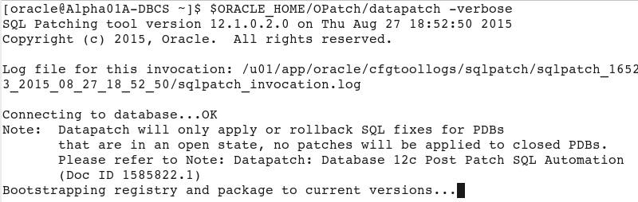
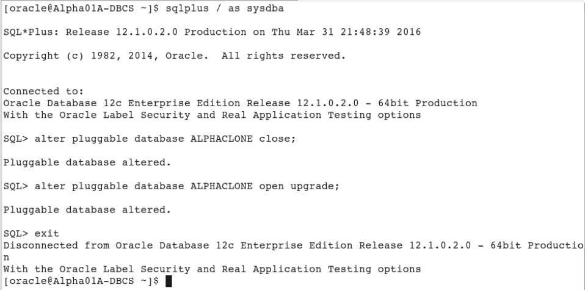

-   Enter the following connection details:

| **Connection Name:** | sys - OPCDBCS                                    |
|----------------------|--------------------------------------------------|
| **Username:**        | sys                                              |
| **Password:**        | Alpha2014\_                                      |
| **Check:**           | “Save Password”                                  |
| **Connection Type:** | SSH                                              |
| **Role:**            | SYSDBA                                           |
| **Service Name:**    | ORCL.&lt;Your Domain ID&gt;.oraclecloud.internal |

***Note:** You can optionally select a color for the connection to
differentiate it from other
connections.*

-   Click **Test** to confirm the information was entered correctly.
    Verify that you receive a ‘Success’ status.

-   Click **Connect** to save the connection information which opens a
    new SQL Worksheet.

#### **Copy the Clone Pluggable Database to the Cloud**

In this step we will copy the cloned pluggable database to the cloud
using SQL Developer.

-   Click on **ViewTask Progress** to open up the Task Progress window.

-   In the DBA window expand ‘**sys – CDB**’ and expand ‘**Container
    Database**’, then right-click on **ALPHACLONE** and select “**Clone
    PDB to Oracle Cloud**”

-   Nothing needs to be changed in this window, verify that the default
    properties include your Public Cloud Connection. Click **Apply**.

<!-- -->

-   Source PDB: **ALPHACLONE**

-   Destination Connection: **sys - OPCDBCS**

-   **Action after clone: RePlug**

-   You will note in the Task Progress window the progress of moving the
    datafiles over to the cloud database. This task will take about a
    minute to complete.

-   Upon completion of the transfer you will be alerted to at least two
    Plugin Violations. This is because the patch level of the local
    ALPHACLONE pluggable database is different than the Container
    database in the cloud. We will remedy this in the next few steps.

-   Click **OK** for **each** popup.

**Note:** The datafiles will be transferred despite what the pop up
implies.

####  **Use EM Express to plug the transferred database**

-   Open Chrome by clicking the icon on the menu bar or the Desktop.

-   Enter the following URL into the Address bar or click the "**EM
    Express - DB**" link in the header bar –
    **https://localhost:5500/em**

**Note:** When using localhost:5500 in the URL below, your browser
request is routed through the SSH proxy that we loaded in a terminal
window in the first lab. If for some reason that window was closed, or
is not working, you should refer to the first lab in step 1.6.2

-   Enter the following login credentials, check the "**as sysdba**" box
    and click the Login button:

| **User Name:** | sys         |
|----------------|-------------|
| **Password:**  | Alpha2014\_ |
| **Check:**     | as sysdba   |

-   We will now plug the Alpha Clone database into the Cloud database.
    From the Database Home page, click the **CDB(1 PDBs)** link.

-   Open the **Actions** list and select the **Plug** command

-   Enter the following filename and directory location in the Metadata
    File field in the Plug PDB dialog box.

Metadata File:
**/u02/app/oracle/oradata/ORCL/ALPHACLONE/ALPHACLONE.XML**

-   **Uncheck** the **Reuse source datafile location from Metadata
    File** check box

-   Enter the Source Datafile Location:

Source Datafile Location: **/u02/app/oracle/oradata/ORCL/ALPHACLONE**

-   Click OK

-   The Processing message displays for the 2 minutes (approximately)
    required to plug the database into the container. Click the **OK**
    button when the Confirmation message displays.

|  |     |  |
|-----------------------------------------------------------|-----|------------------------------------------------------------|

-   Notice the database is now in the list of Containers**. **

**Note: There will be Violations because of the patch level mismatch
between the original source Pluggable database and the Cloud Container
database**.

-   You now need to SSH into the Cloud database server in order to patch
    the database. Example is shown below. Substitute your Cloud database
    server IP address (Alpha01A-DBCS)

-   Open a Terminal and type the following SSH command to connect to the
    cloud database server.

-   ssh -o ServerAliveInterval=60 -i /u01/OPCWorkshop/lab/labkey
    oracle@&lt;Alpha01A-DBCS-IP-address&gt;

-   We’ll need to run the **datapatch script** to apply any
    missing patches. It should run with no errors.

**Note: If it complains the first time about not being able to determine
the current opatch status then wait a minute until it’s had time to pick
up the newly cloned pluggable database and retry.**

-   $ORACLE\_HOME/OPatch/datapatch -verbose

In the next few steps we’ll upgrade the PDB.

**Note:** If you receive an error message like, “**The pluggable
databases that need to be patched must be in upgrade mode**” complete
the following upgrade PDB Step. If not, proceed directly to the next
step (Close and Reopen ALPHACLONE PDB).

-   Put the database in upgrade mode to correct the patch errors.

<!-- -->

-   Connect to container database using SQL Plus and place the database
    in **upgrade mode**. Once completed run **datapatch** again and you
    should have no errors. Run the following commands to complete
    this step.

-   sqlplus / as sysdba

-   alter pluggable database ALPHACLONE close;

-   alter pluggable database ALPHACLONE open upgrade;

-   exit

-   $ORACLE\_HOME/OPatch/datapatch -verbose

-   **Close and Reopen ALPHACLONE PDB**

<!-- -->

-   The final step is to close and reopen the ALPHACLONE
    pluggable database. Go back to EM Express, with the ALPHACLONE
    row highlighted. (DO NOT CLICK THE ALPHACLONE LINK).

-   Select **Actions Close**.

