-   Accept the defaults and Click **OK**.

-   Close the Confirmation pop up by clicking **OK**.

-   Reopen the pluggable database via **Actions Open**.

-   Accept the default to open it Read / Write. Click **OK**.

-   Close the Confirmation pop up by clicking **OK**.

-   Refresh the browser page using the refresh icon in the top
    right corner.

-   Note that the violations are now gone.

-   Click the **ALPHACLONE** container name link to review the
    database information.

#### **Create an SQL Developer connection to the Public Cloud database ALPHACLONE schema**

-   In the SQL Developer application, click the green plus sign
     in the
    Connections window to create a new connection; enter the following
    connection details:

| **Connection Name:** | Alpha Clone – DBCS                                     |
|----------------------|--------------------------------------------------------|
| **Username:**        | alpha                                                  |
| **Password:**        | oracle                                                 |
| **Check:**           | “Save Password”                                        |
| **Connection Type:** | SSH                                                    |
| **Service Name:**    | Alphaclone.&lt;Your ID Domain&gt;.oraclecloud.internal |

***Note:** You can optionally select a color for the connection to
differentiate it from other connections.*

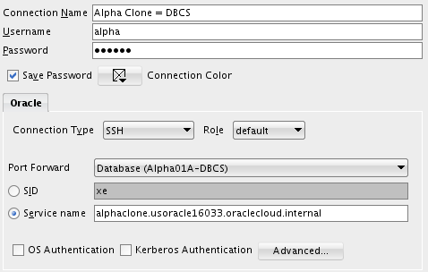

-   Click **Test** to confirm the information was entered correctly.

-   Click **Connect** to save the connection information and open a
    new SQL Worksheet.

-   You have successfully migrated a pluggable database from on premise
    to the cloud. In the next section we’ll migrate data using
    Data Pump.

    1.  ### Cloud Migration Using Data Pump

        1.  #### **Export the Alpha Schema**

The first step will be to create a local Data Pump Directory.

-   In the Connections Tab inside the "On-Premise" folder navigate to
    the **Alpha - PDB Directories** item, right-mouse click and select
    **Create Directory…**

> **Note**: The default Data Pump directory object, DATA\_PUMP\_DIR,
> does not work with PDBs. Data Pump requires an explicit directory
> object within the PDB for exporting or importing schemas or tables.

-   Enter the following values and click **Apply**. Remember to use the
    SQL tab to review the actual DDL statement. Click **OK** to dismiss
    the confirmation.

| **Directory Name:**            | alpha\_backup\_dir (not case sensitive) |
|--------------------------------|-----------------------------------------|
| **Database Server Directory:** | /u01/OPCWorkshop                        |

> **NOTE:** You may receive an error message stating that “An error was
> encountered performing the requested operation:” and that the
> directory cannot be created. To eliminate this error right-click on
> Alpha - PDB and choose Disconnect. Then Reconnect. The error occurs
> because you were connected earlier while performing the UNMOUNT /
> REMOUNT and during the previous “cloning” of the PDB container the
> connection information was lost. Reconnecting will normally solve this
> issue.

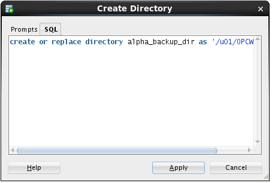

-   Now that we’ve created the Data Pump export directory the next steps
    will outline how to create and run a Data Pump Export job using SQL
    Developer

<!-- -->

-   In the DBA Window, **Add Connection** by clicking on the Green
    Plus sign.

-   Select the **Alpha - PDB** connection and click the **OK** button.

-   Expand **Alpha - PDB**, expand **Data Pump**, then right-mouse-click
    on **Export Jobs,** and then select the **Data Pump Export Wizard…**
    menu item.

-   Select the **Schemas export** type and click the **Next** button.

-   Select the **ALPHA** schema and use the blue arrow to move it to the
    right-hand column. Click **Next**.

-   We are not filtering out any objects, click the **Next** button.

-   We are not applying where clauses to table data, click the
    **Next** button.

-   We want a log for this export, and just like the actual export file,
    we must pick a directory from the list of directories in
    the database.

<!-- -->

-   Select **ALPHA\_BACKUP\_DIR** from the list and click the
    **Next** button.

-   The most important selection for any Data Pump operation is choosing
    the directory where the export file will be written.

<!-- -->

-   Select **ALPHA\_BACKUP\_DIR** from the Directories drop down list.

-   Then, select the **Delete Existing Dump Files** radio button and
    click the **Next** button.

**Note**: Data Pump always uses a server side directory for all export
or import operations.

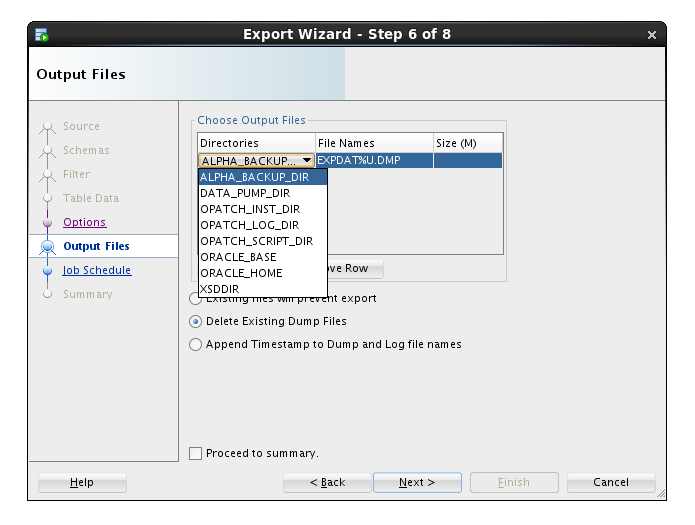

-   Data Pump jobs can be scheduled to run at any time and on any
    desired times of the day, week or year. We will run the job
    immediately - click the **Next** button.

-   On the Summary panel, click the **PL/SQL** tab to review the
    job definition. Review the PL/SQL use of Oracle Supplied PL/SQL
    subprograms for Data Pump. Click the **Finish** button to create
    the job.

|  | 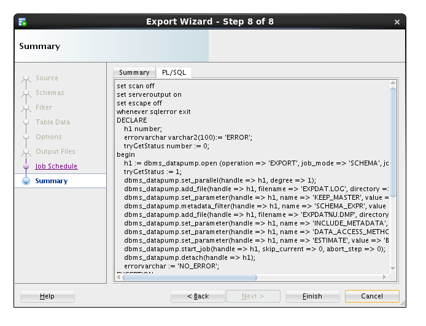 |
|------------------------------------------------------------|------------------------------------------------------------|

-   For a brief time, SQL Developer shows a progress dialog while it
    creates the job in the database.

**Note:** the import actually runs as a job in the database so this
message is only about creating and scheduling the export.

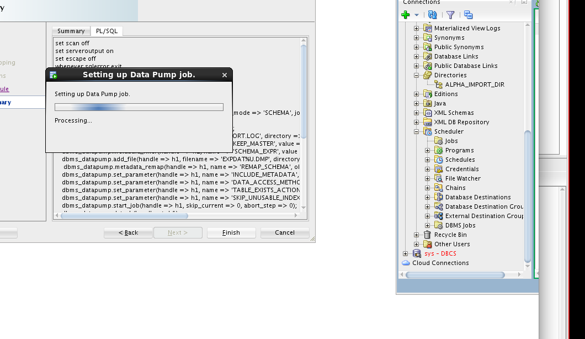

-   While the job is running, you may view status information by
    clicking on the export job added to the DBA Navigator panel. It may
    take a couple of minutes so click the **Refresh**
    icon until
    the job is completed (NOT RUNNING).

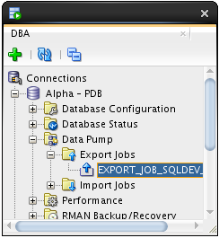

-   Now we’ll copy the export Data Pump file to the server

<!-- -->

-   Start a Terminal window using the top panel icon.

-   Enter the following commands to print the working directory
    (**pwd**), list the directory (**ls**) contents and review the Data
    Pump log file.

$ pwd

$ ls

$ cat EXPDAT.LOG

Use the following secure copy (**scp**) command to transfer the Data
Pump export to the DBCS server. Use the Database Service Private IP
address you identified in the first lab.

$ scp -i lab/labkey EXPDAT01.DMP oracle@&lt;Alpha01A-DBCS public
IP&gt;:~

***Note:** the tilde (~) represents the oracle user's home directory.*

#### **Import Alpha to a new Schema**

-   As we begin the import phase of this example we’ll first create an
    import directory in the Alpha Clone PDB.

<!-- -->

-   Use SQL Developer and expand the **Alpha Clone - DBCS** connection.

-   Right-mouse-click on the **Directories** tree item and select the
    **Create  Directory…** menu item.

-   Enter the following values and click the **Apply** button.

-   Click **OK** to dismiss the confirmation message. This lets the
    database access the same directory where the Data Pump export file
    was copied.

| ***Directory Name:***                                      | alpha\_import\_dir |
|------------------------------------------------------------|--------------------|
| ***Database Server Directory:***                           | /home/oracle       |
|  |                    |

-   The next few steps will outline creating the Data Pump Import job.
    To access the Data Pump features, we need to add the clone
    connection to the DBA Navigator.

<!-- -->

-   Click on the green plus sign, Add Connection icon on the DBA
    Navigator panel

-   Select **Alpha Clone - DBCS** connection and click **OK**.

-   Expand **Alpha Clone - DBCS** **Data Pump**

-   Right-mouse on the **Import Jobs** menu item, and select **Data Pump
    Import Wizard…** menu item.

-   Select **Schemas** from the ‘Type of Import box and Choose
    **ALPHA\_IMPORT\_DIR** from the ‘Choose Input Files’ drop down list,
    then click **Next**.

**Note:** This action might take a few minutes. There is some wait time
while the database locates and scans the import file in the selected
directory.

-   Move the **ALPHA** schema from the left to the right column using
    the arrow button and click **Next**.

-   For this lab, we are creating a new schema, so we will enter the new
    schema name as the destination.

<!-- -->

-   Under the Re-Map Schemas section click **Add Row**.

-   Enter the following values and click the **Next** button.

| **Source: **     | ALPHA (should be the default item) |
|------------------|------------------------------------|
| **Destination:** | ALPHA\_COPY                        |

-   We want to see the log output so we will select the same directory
    as the import file directory.

<!-- -->

-   Select **ALPHA\_IMPORT\_DIR** and click the **Next** button.

**Note:** For lab purposes we will execute the import immediately. In
normal operations this job could be set up to refresh a development
database on a daily basis.

-   Click the **Next** button.

-   Click the PL/SQL tab to review the small program that establishes
    the import job. Click the **Finish** button to create the job.

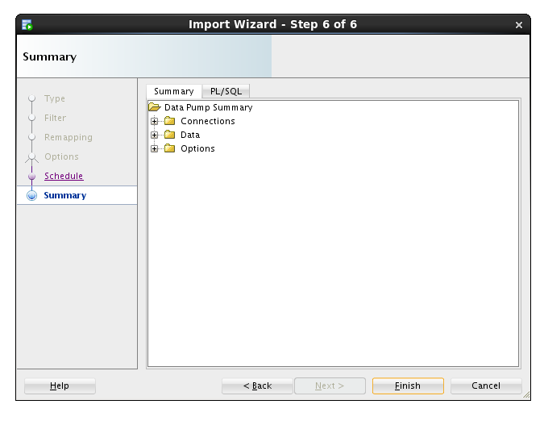
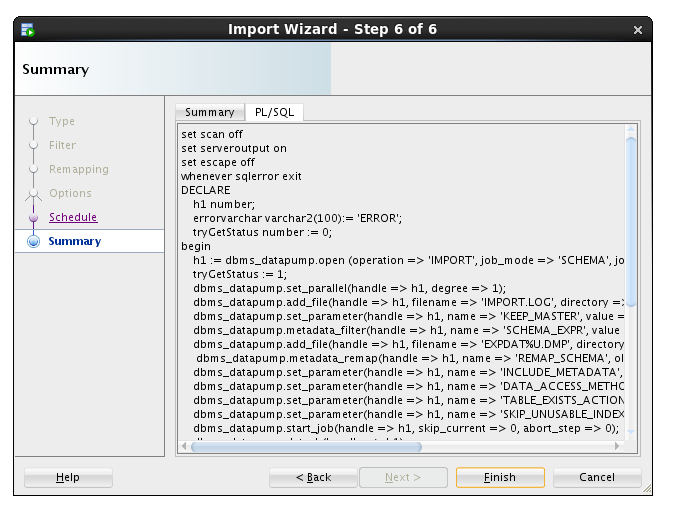

**Note:** For a period of time SQL Developer shows a progress dialog
while the job is being created. The job does not run locally you’re
seeing the progress of creating the job in the database.

-   Locate and click on the job name to see the detailed status as the
    job runs. When the job completes, the database automatically removes
    the job. You will need to use the **Refresh** icon
     to see
    when the job finishes.

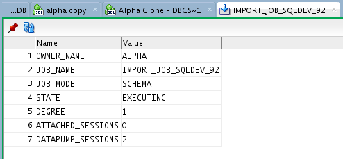

-   If you are interested in verifying that the ALPHA\_COPY schema is
    the same as the ALPHA schema, feel free to create a connection
    and compare.

    1.  ### Cloud Migration Using SQL Developer Carts

        1.  #### **Creating an SQL Developer Cart**

The SQL Developer Cart is a convenient method for organizing the
deployment of database objects and data from one database to another. In
this trivial example, we want to update the data of just the CUSTOMERS
and PRODUCTS table in the development cloud database. More elaborate
usages of the cart can help package entire application deployments,
including pre and post processes from multiple data sources.

-   Show the Cart using the **View** &gt; **Cart** menu option.

-   If Cart\_1 is not already created (it should be), Click on the **New
    Cart** icon.

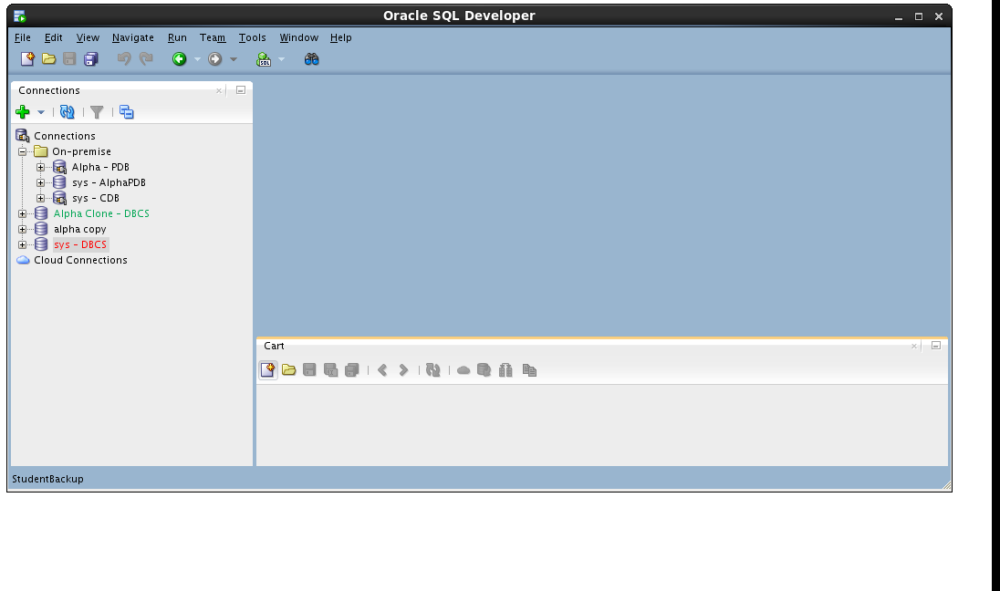

-   Drag the **CUSTOMERS** table from the **Alpha - PDB** connection to
    the cart.

-   Drag the **PRODUCTS** table to the cart.

-   Include a script that runs before any other Cart activity. For this
    lab, we are disabling all the referential integrity constraints so
    we can delete and insert data without regard to foreign keys on
    our tables.

-   In the Cart window click small down arrow next to the **green plus**
    “+” icon and select **Add Initial Script**

-   Click the **Browse…** button.

-   Locate the following file and click **Open**:

/u01/OPCWorkshop/lab/disable-constraints.sql

-   Click **OK**.

-   Click the down arrow next to the **green plus** “+” icon again and
    select **Add Final Script** which is included as the last operation
    performed during the cart operations.

**Note:** There can only be one Initial or Final script in a Cart.

-   Click the **Browse…** button

-   Locate the following file and click **Open**:

/u01/OPCWorkshop/lab/enable-constraints.sql

-   Click **OK**.

-   We are not creating any tables in this lab; uncheck the **DDL**
    column heading.

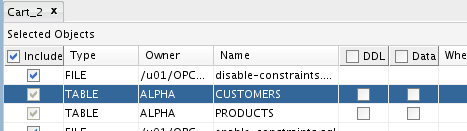

-   We will move the data, include a check the **Data** column heading.

-   Before we can overwrite the new rows in the CUSTOMERS table, we need
    to truncate the table.

<!-- -->

-   Click in the **Scripts** column cell for the CUSTOMERS table and
    then click the **pencil icon**.

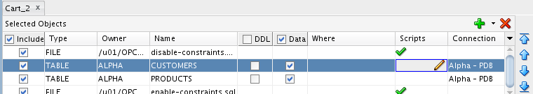

-   Check the **Before Load** box, then click the **Browse…** button and
    select the following file:

/u01/OPCWorkshop/lab/truncate-customers.sql

-   Click **OK**:

-   Repeat the operation for the PRODUCTS table; click the **pencil
    icon** on the products row.

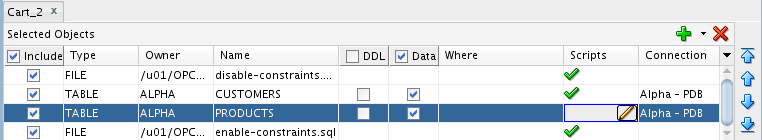

-   Click the **Before Load** button, then click on the **Browse**…
    button and select the following file:

/u01/OPCWorkshop/lab/truncate-products.sql

-   Click **OK**:

#### **Export the SQL Developer Cart**

-   Now that the cart is complete, click the **Export Cart** toolbar
    icon to generate the script of all the elements we inserted in
    the cart.

-   Click the **Apply** button to generate script.

**Note:** The selections on this page may be saved and later reused if
the cart is regularly used the same way.

-   If the file already exists, SQL Developer asks you to confirm
    overwriting it with new content. If you see this prompt, click the
    **Yes** button.

-   Review the contents of the script with particular attention to the
    SQL statements that have been inserted based on the scripts
    we included.

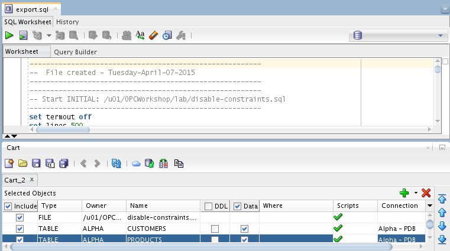

-   Run the script by clicking the **Run Script** icon and selecting the
    **Alpha Clone** **— DBCS** connection.

-   Click **OK**.

<!-- -->

-   SQL Developer shows a progress bar while the script runs. Depending
    on your window layout, you may see the command output scrolling by
    while the script runs.

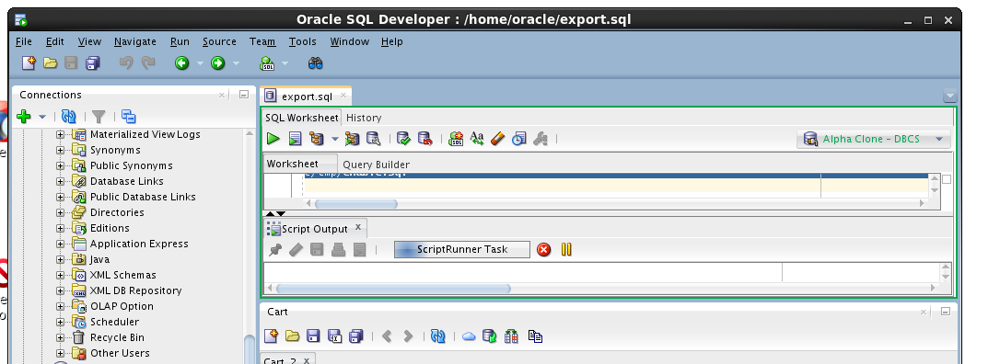

-   When the script is complete, review the script output looking for
    the execution of both the script elements and the DML statements.

-   This concludes Lab 2 – Cloud Migration, proceed to the next lab when
    you’re ready.

1.  Backup and Recovery
    ===================

    1.  ### Introduction

Oracle Database Backup Service (ODBS) is a new backup-as-a-service
offering that enables customers to store their backups securely in the
Oracle cloud. ODBS provides a transparent, scalable, efficient, and
elastic cloud storage platform for Oracle database backups. The Client
side Oracle Database Cloud Backup Module which is used with Recovery
Manager (RMAN) transparently handles the backup and restore operations.

Oracle Database Cloud Backup Module is the cloud backup module that is
installed in the database server. During the install process, a platform
specific backup module is downloaded and installed. The RMAN environment
of the client database is configured to use the cloud backup module to
perform backups to ODBS. Using familiar RMAN commands, backups and
restores are transparently handled by the cloud backup module.

### Objectives

-   Install the Oracle Database Cloud Backup Module onto the VM image
    provided in the workshop. The database provided in the VM represents
    the on premise database in a typical customer situation.

-   Configure RMAN to support the Oracle Database Cloud Backup Module.
    Then, backup the database and take a restore point to be used
    for Point-In-Time-Recovery.

-   Simulate a destructive database operation and then restore and
    recover to a specific Point-In-Time.

    1.  ### Lab Requirements

<!-- -->

-   VNC Viewer to access the client system

    1.  ### Oracle Public Cloud Backup Recovery

        1.  #### **Start the On-Premise Oracle Database**

<!-- -->

-   Access the Virtual Client image following the prior instructions
    regarding the VNC viewer.

-   If your local database is not running for some reason (it should be
    at this point) locate and double-click the **StartDB** icon**.**

#### **Install the Cloud Backup Module**

-   The .jar file (opc\_install.jar) used to install the Cloud Backup
    Module has already been placed into the
    /u01/OPCWorkshop/lab directory.

<!-- -->

-   **Open a Terminal Window**, cd into the **lab** directory and
    execute the following OS commands to verify that
    opc\_install.jar exists.

$ cd lab

$ pwd

$ ls \*.jar

-   The installation command with all of the options is rather lengthy.
    In order to make things easier for you and eliminate potential typos
    the installation command has been saved into a text file named
    **Workshop\_Commands\_URLs.txt**. The file is represented by an icon
    on the Client Image Desktop.

<!-- -->

-   Double click on the Workshop\_Commands\_URLs.txt icon to open up
    the file.

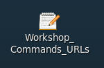

-   Find the “**OPC Cloud Backup Installation**” section in the
    text file.

-   Replace **&lt;opc-identity-domain&gt; &lt;opc-username&gt;** and
    **&lt;opc-passwd&gt;** (including replacing the &lt;&gt;) with the
    **Identity Domain, Username, and Password** student account
    information you were assigned. Also, be sure to put single quotes
    around your password to avoid any issues with special characters.

<!-- -->

-   Before:

-   After

-   **Copy and Paste** the updated command from the text file into your
    terminal and hit Enter.

-   The installation command creates a configuration file
    “**opcorcl.ora**” and wallet directory “**opc\_wallet**” and places
    these in $ORACLE\_HOME/dbs. It also downloads a library file
    “**opclib.so**” that RMAN uses to communicate with the Oracle
    Database Backup Service and places that in $ORACLE\_HOME/lib. You
    specified these locations in the syntax of the install command.

