1.  Database Development
    ====================

    1.  ### Introduction

In this lab you will deploy an APEX application to the Alpha Clone PDB
and adjust the firewall rules to support access to the application from
the Internet using a PC based browser or mobile device.

### Objectives

-   Enable APEX in the Alpha Clone PDB.

-   Create APEX REST services

-   Deploy and access an Alpha Office APEX application.

    1.  ### Lab Requirements

-   The following lab assume that the steps outlined in lab guides 100
    and 200 have been completed.

-   VNC Viewer for access to the cloud client image

-   The SSH tunnels must be active in a terminal window.

    1.  ### Alpha Office and APEX

        1.  #### **APEX Workspace Administration**

The Alpha Clone database contains an unused APEX configuration. As the
first part of this lab we will complete the configuration of the cloned
database APEX configuration.

**Note:** The standard install of APEX for a 12c database created many
objects shared by both the container and pluggable database but user and
password information is always local to the database we access. In other
words, the APEX password we set in Lab 100 has not been in the cloned
database.

-   Make sure the SSH tunnels you set up in lab 100 are still active in
    your terminal window, if not refer to lab 100 to set up the
    SSH tunnels.

<!-- -->

-   During the plug-in operation, many of the common objects in the
    pluggable database were evaluated by the database and some changes
    were made to the new database to work with its new container. One of
    these adjustments was locking the database accounts used to provide
    REST services. We will need to unlock the APEX\_LISTENER and
    APEX\_REST\_PUBLIC\_USER accounts.

<!-- -->

-   If it’s not already running, startup SQL Developer from the Cloud
    Client desktop on the VNC connection.

-   Open the DBA Window and locate the **Alpha Clone - DBCS** item
    (created in Lab 200) in the **DBA Navigator**

-   Expand it and click on the **SecurityUsers** item.

-   Right-mouse on **APEX\_LISTENER** and select **Unlock User…**

-   Click the **Apply** button to unlock APEX\_LISTENER. You may also
    use the SQL tab to review the unlock statement.

-   Repeat the **Unlock User…** operation for the
    **APEX\_REST\_PUBLIC\_USER**.

#### **Create the Alpha Office workspace **

-   In the **Chrome** browser, open up a new tab and test the updated
    rule by accessing the APEX instance in the container database from
    the Internet. Use the Public IP address from the cloud instance we
    created in the first lab.

**Note:** Be sure to use the https protocol.

**https://&lt;your-Public-IP&gt;/apex/alphaclone/apex\_admin**

-   After you’ve accepted the SSL certificate and see the APEX
    administration page, enter the following admin credentials and click
    the **Login to Administration** button:

| **Username:** | admin       |
|---------------|-------------|
| **Password:** | Alpha2014\_ |

-   You ***may*** be prompted to change the ADMIN user password, if not,
    skip to the next step. These credentials apply to the APEX objects
    local to the pluggable database. For convenience, we will enter the
    same password as the container database.

-   Enter the following values and click the **Apply Changes** button.

| **Enter Current Password:** | Alpha2014\_ |
|-----------------------------|-------------|
| **Enter New Password:**     | Alpha2015!  |
| **Confirm New Password: **  | Alpha2015!  |

-   After logging in successfully, feel free to click around in the APEX
    interface to get familiar with it.

-   When you’re ready to begin, click the **Create Workspace** button

-   At the **Identify Workspace** dialog, enter the following workspace
    name and click the **Next** button.

| **Workspace Name:** | AlphaDev |
|---------------------|----------|

-   At the **Identify Schema** dialog, select and enter the following
    values followed by the **Next** button.  
      
    **Note:** Use the search icon
     to find the
    ALPHA schema.

| **Re-use existing schema?** | Yes   |
|-----------------------------|-------|
| **Schema Name:**            | ALPHA |

At the **Identify Administrator** dialog, enter the following values and
click the **Next** button.

| **Administrator Username:** | ADMIN                                   |
|-----------------------------|-----------------------------------------|
| **Administrator Password:** | Alpha2014\_ (May be prompted to change) |
| **Email:**                  | dummy@localhost.localdomain             |

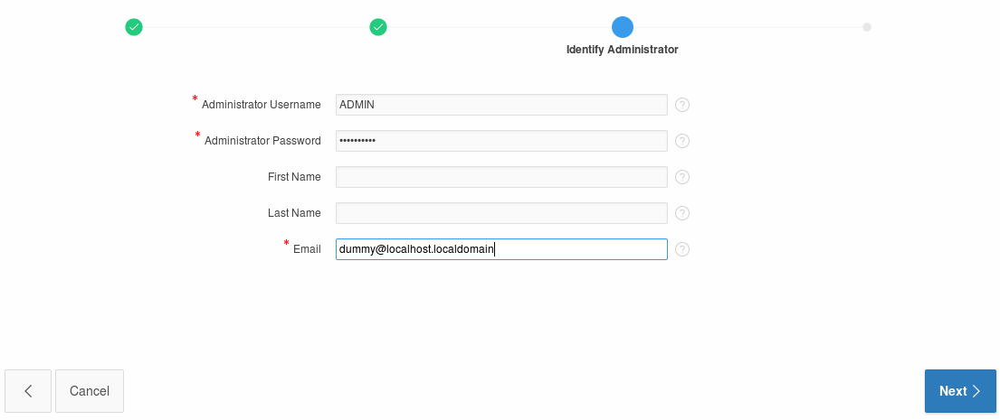

-   Review the selections on the Confirm Request page and then click the
    **Create Workspace** button.

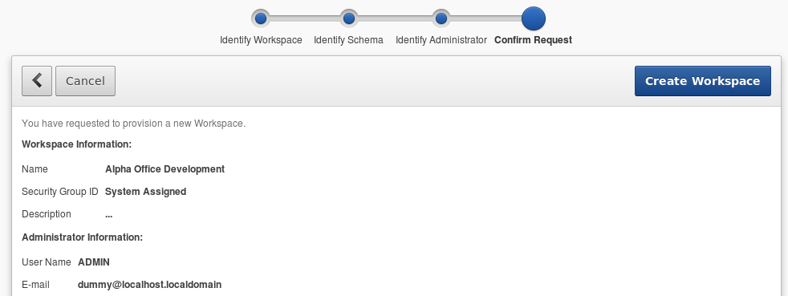

-   APEX will display the ‘Workspace Created’ message

-   Click **Done**

-   Click the ADMIN dropdown in the upper right and select **Signout**

-   Click the Return to **‘Sign In Page’** to continue

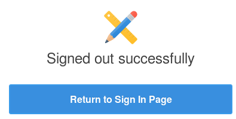

#### **Build REST services**

-   Login to the Alpha Office APEX development workspace using the
    following credentials.

| **Workspace:** | AlphaDev    |
|----------------|-------------|
| **Username:**  | ADMIN       |
| **Password:**  | Alpha2014\_ |

-   You ***may*** be prompted to change your password. Enter the
    following values and click the **Apply Changes** button.

| **Enter Current Password** | Alpha2014\_ |
|----------------------------|-------------|
| **Enter New Password**     | Alpah2015!  |
| **Confirm New Password **  | Alpha2015!  |

-   Once you’ve logged in successfully, click the **SQL
    Workshop** button.

-   Click the **RESTful Services** button.

-   Click the **Create &gt;** button

-   There are three sections on the RESTful Services page:

<!-- -->

-   Restful Services Module

-   Resource Template

-   Resource Handler

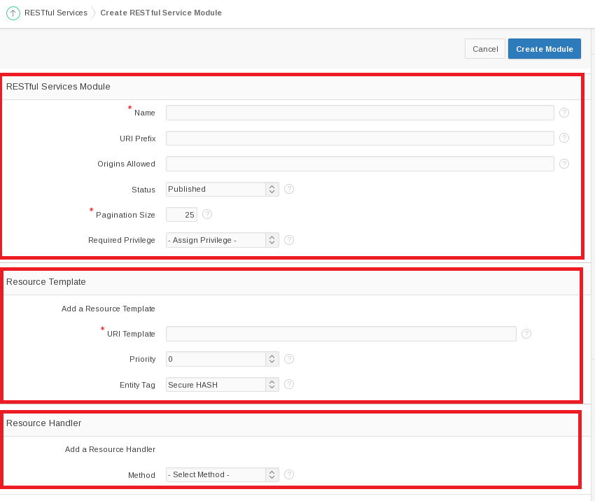

-   Fill out the information for these sections using the information
    provided below.

<!-- -->

-   For the **RESTful Services Module** section, use the following
    values:

| **Name:**       | alpha.office |
|-----------------|--------------|
| **URI Prefix:** | alphaofc/    |

-   In the **Resource Template** section enter the following value:

| **URI Template** | products/ |
|------------------|-----------|

-   For the last section titled **Resource Handler** use the following
    values:

| **Method:**      | GET                     |
|------------------|-------------------------|
| **Source Type:** | Query                   |
| **Format:**      | JSON                    |
| **Source:**      | select \* from products |

-   Click **Create Module** to complete the REST service creation.

-   APEX will show the new service module with a confirmation message.

<!-- -->

-   Click the **GET** handler for our template in the folder structure
    on the left of the screen.

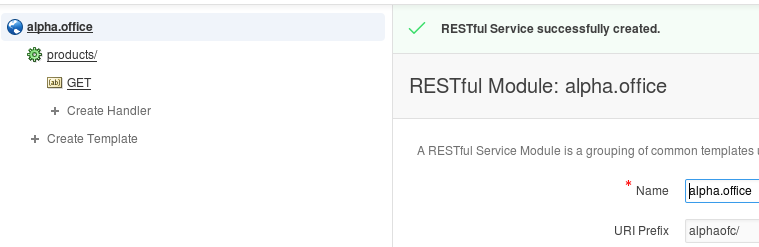

-   Review the definition.

-   Since this operation has no parameters, we can easily test it by
    clicking the **Test** button.

-   Review the JSON produced by the service.

-   Click the browser's **back button** to return to the APEX page.

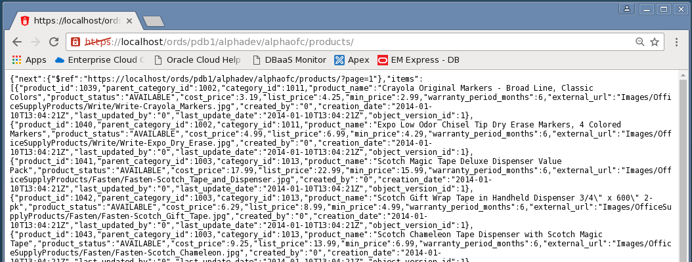

#### **Create a Parameterized REST Service**

-   In the next section we will create a REST service that takes a
    product number and returns only one database row as a JSON object.

<!-- -->

-   Click the **Create Template** link.

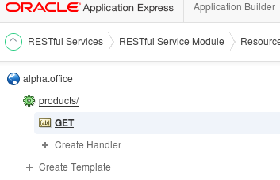

-   Enter the following URI Template.

**Note:** The **{id}** syntax indicates the REST call accepts one
parameter named "id" - this is automatically available in later for SQL
queries.

-   When the entry is complete, click the **Create** button.

| **URI Template:** | product/{id} |
|-------------------|--------------|

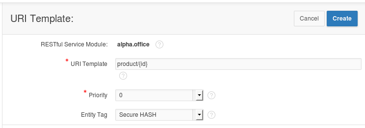

-   APEX displays a success message for the new template

-   Click the **Create Handler** link under the **product/{id}**
    template on the left side of the screen.

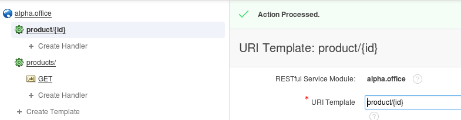

-   Enter the following SQL statement in the Source field of the
    Resource Handler page. Notice the use of the ":id" bind variable,
    this value comes from the URI template {id} provided when the
    service is invoked.

**Source:**

select \*

from products

where product\_id = :id

-   Once you’ve finished entering the SQL statement, click the
    **Create** button.

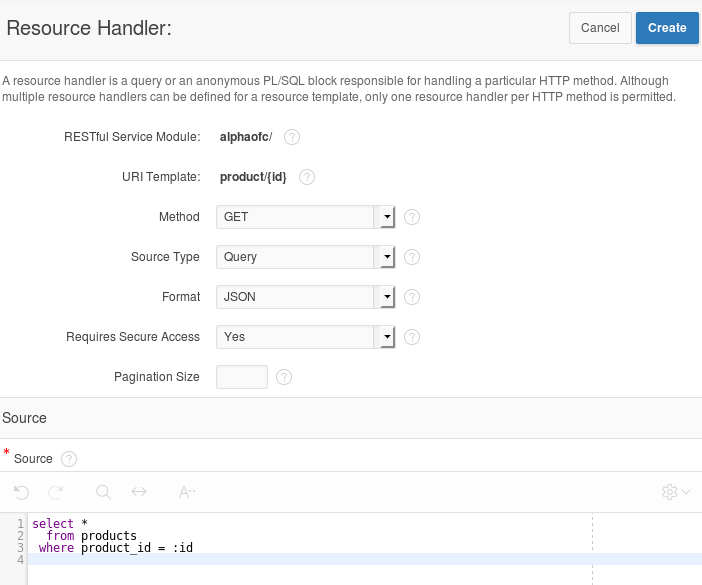

-   Notice the ‘Action Processed’ at the top of your screen. We will
    test this service just like before, but we need to provide a product
    number to the call.

<!-- -->

-   **Scroll** to the bottom of the page and in the Test section, click
    the **Set Bind Variables** button.

-   Enter the following product number and click the **Test** button.

| **:ID** | 1020 |
|---------|------|

-   In the new browser window, notice only the single product shows in
    the JSON object.

<!-- -->

-   **Close** this pop-up window.

> 

#### **Install APEX Mobile Application**

-   Click the **Application Builder** menu item on the APEX page.

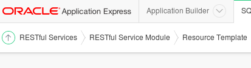

-   Click the **Import** button on the Application Builder page.

-   Click the **Browse** button to locate the APEX application
    export file.

-   Locate and open the following file and click the Open button:

**/u01/OPCWorkshop/lab/f101.sql**

-   Click the **Next** button to continue.

-   After a brief pause while the application file is processed, click
    the **Next** button to continue.

-   On the final page, select to **Reuse Application ID 101 from Export
    File**

-   Click **Install Application**.
    

<!-- -->

-   APEX displays a success message for the import

-   Click **Run** **Application**.

-   APEX renders the first page of the mobile application in the browser
    – it might not look quite right since we are using a
    mobile template.

#### **Access the Alpha Office Mobile Application on your Smart Device**

-   Using any Internet connected smart phone or tablet we will access
    the mobile application using the port we opened earlier in the lab.
    This example is using an Apple iPhone 5s.

<!-- -->

-   Use your device's browser and navigate to the following URL:

**https://&lt; Public IP Address of
Alpha01A-DBCS&gt;/apex/alphaclone/f?p=101**

-   The browser should prompt you to accept the unknown certificate.

-   Click of touch **Continue**.

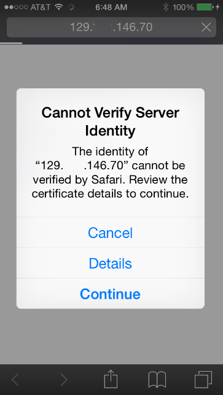

-   Touch the screen to explore the application. On the device, touching
    one of the pie slices highlights the slice; a second tap drills into
    that slice.

-   Congratulations, you’ve created an application on the Oracle
    Database Cloud. This is the final lab for the DBCS Workshop.

